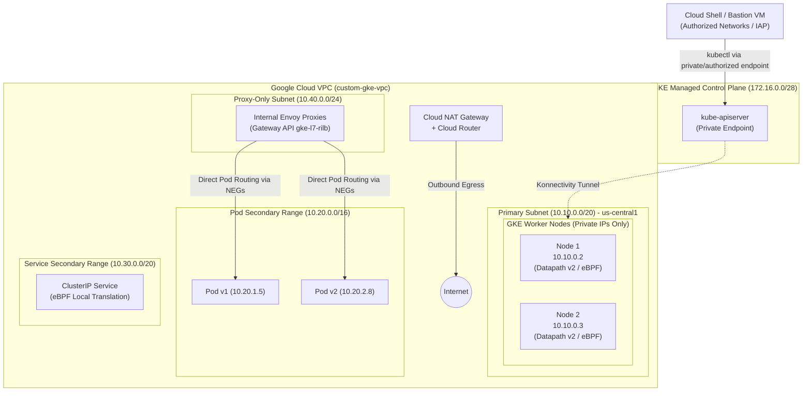

# GKE Enterprise Networking Hands-On Lab

[](https://cloud.google.com/kubernetes-engine)
[-green.svg)](https://cloud.google.com/kubernetes-engine/docs/concepts/dataplane-v2)
[](https://gateway-api.sigs.k8s.io/)
[](https://squidfunk.github.io/mkdocs-material/)

A comprehensive, self-service hands-on laboratory designed for Platform Engineers, Site Reliability Engineers (SREs), and Cloud Architects to master modern **Google Kubernetes Engine (GKE) Enterprise Networking**.

This guide covers real-world enterprise architectures: **Private Clusters**, **VPC-Native Alias IP Routing**, **Datapath v2 (eBPF/Cilium)**, **Cloud DNS for GKE**, **Container-Native Load Balancing (NEGs)**, the modern **Kubernetes Gateway API**, and zero-downtime **Deployment Strategies** (Canary, A/B testing, Blue/Green, and Traffic Mirroring).

---

## 🏛️ Enterprise Architecture Overview



---

## 📚 Lab Modules

| Module | Title | Topics Covered |
| :--- | :--- | :--- |
| **01** | [**Enterprise Cluster Setup**](docs/01-cluster-setup/index.md) | Custom VPC, Subnets, Secondary IP Ranges, Cloud NAT, Private GKE with Datapath v2, Gateway API, and Authorized Networks. |
| **02** | [**Networking Fundamentals**](docs/02-networking-fundamentals/index.md) | VPC-native Alias IPs, Datapath v2 (eBPF/Cilium) inspection, Cloud DNS for GKE, and Pod-to-Pod packet traces. |
| **03** | [**Services & Load Balancing**](docs/03-services-and-load-balancing/index.md) | ClusterIP packet flows, Headless services, Internal TCP/UDP Load Balancers, and Standalone Network Endpoint Groups (NEGs). |
| **04** | [**Gateway API**](docs/04-gateway-api/index.md) | `GatewayClass`, `Gateway`, `HTTPRoute`, `ReferenceGrant`, Internal Application Load Balancers (`gke-l7-rilb`), URL rewrites, and TLS. |
| **05** | [**Deployment Strategies**](docs/05-deployment-strategies/index.md) | Progressive Delivery with Gateway API: Canary (weighted traffic), A/B testing (headers/queries), Blue/Green instant cutovers, and Traffic Mirroring. |
| **06** | [**Network Security & Policies**](docs/06-network-security/index.md) | Datapath v2 eBPF NetworkPolicies, default deny, namespace isolation, and FQDN egress domain filtering. |
| **07** | [**Troubleshooting & Observability**](docs/07-troubleshooting/index.md) | Diagnosing Gateways, NEGs, Hubble eBPF observability, packet drops, and production runbooks. |
| **Teardown** | [**Resource Cleanup**](docs/cleanup.md) | Safe decommissioning of all cloud and cluster resources to prevent unnecessary cloud spend. |

---

## ⚡ Quickstart

### Prerequisites
1. **Google Cloud Project** with billing enabled.
2. **`gcloud` CLI** installed and configured (`gcloud auth login`).
3. **`kubectl`** (`gcloud components install kubectl`).
4. **`jq`** and **`curl`** for API verification.

### Option A: Using the Automated Scripts
```bash
# 1. Clone this repository
git clone https://github.com/amr1k/gke-fundamentals-lab.git
cd gke-fundamentals-lab

# 2. Configure GCP variables
export PROJECT_ID="your-project-id"
export REGION="us-central1"
export ZONE="us-central1-a"

# 3. Create the Custom VPC, Subnets, and Cloud NAT
bash scripts/01-setup-vpc.sh

# 4. Provision the Private GKE Cluster
bash scripts/02-create-cluster.sh
```

### Option B: Step-by-Step Hands-On Guide
Follow the modules sequentially starting from [Module 1: Enterprise Cluster Setup](docs/01-cluster-setup/index.md).

---

## 📖 Viewing & Publishing Documentation

This repository is formatted for **MkDocs Material** and is configured to publish automatically to **GitHub Pages**.

### Running Locally
```bash
# Install Python dependencies
pip install mkdocs-material

# Start local preview server
mkdocs serve
```
Open `http://127.0.0.1:8000` in your browser.

### Publishing to GitHub Pages
1. Push this repository to GitHub:
   ```bash
   git remote add origin https://github.com/<your-org>/gke-networking.git
   git branch -M main
   git push -u origin main
   ```
2. In your GitHub repository, navigate to **Settings** > **Pages**.
3. Under **Build and deployment**, select **GitHub Actions**.
4. The workflow at `.github/workflows/deploy-pages.yml` will automatically build and publish your site!

---

## 🧹 Cleanup
To delete all resources created during this lab and avoid billing charges:
```bash
bash scripts/99-cleanup.sh
```

