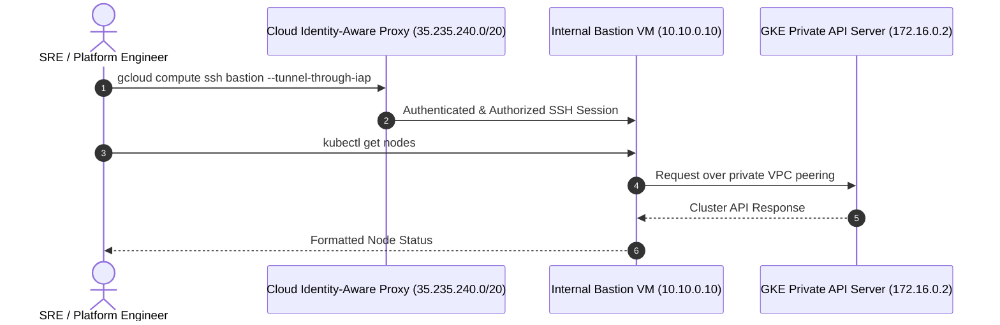

# Step 3: Bastion & Cluster Access

Because the GKE cluster was created with `--enable-master-authorized-networks`, unauthorized IP addresses cannot communicate with the Kubernetes API server. In this step, you will configure administrative access to `kubectl` using either your authorized workstation IP or an Identity-Aware Proxy (IAP) bastion VM.

---

## 1. Option A: Authorize Your Workstation / Cloud Shell

If your organization allows access to the GKE control plane endpoint from trusted corporate IPs or Cloud Shell:

### 1.1 Detect Your Current Public IP
```bash
MY_IP=$(curl -s https://ifconfig.me/ip)
echo "Your IP is: ${MY_IP}"
```

### 1.2 Add IP to Master Authorized Networks
```bash
gcloud container clusters update ${CLUSTER_NAME} \
    --zone=${ZONE} \
    --enable-master-authorized-networks \
    --master-authorized-networks=${MY_IP}/32
```

> [!NOTE]
> If you are using Google Cloud Shell, you can obtain your Cloud Shell IP or configure `--enable-master-authorized-networks` to include the Cloud Shell IP. You can also specify multiple comma-separated CIDR blocks for team members or CI/CD runners.

---

## 2. Option B: Enterprise Bastion Host via Cloud IAP

In high-security enterprise environments, the cluster control plane is restricted strictly to the private endpoint (`--enable-private-endpoint`). To interact with such a cluster, engineers connect through an internal bastion VM using Google Cloud Identity-Aware Proxy (IAP).



### 2.1 Deploy a Lightweight Bastion VM
```bash
gcloud compute instances create gke-bastion \
    --project=${PROJECT_ID} \
    --zone=${ZONE} \
    --machine-type=e2-micro \
    --network=${VPC_NAME} \
    --subnet=${SUBNET_NAME} \
    --no-address \
    --metadata=enable-oslogin=TRUE \
    --tags=bastion
```

> [!NOTE]
> The `--no-address` flag ensures that the VM has **no external IP address**. Inbound traffic is tunneled through Google Cloud IAP, which was permitted in our firewall rule for `35.235.240.0/20`.

### 2.2 Add Bastion IP to Master Authorized Networks
```bash
BASTION_IP=$(gcloud compute instances describe gke-bastion \
    --zone=${ZONE} \
    --format="value(networkInterfaces[0].networkIP)")

gcloud container clusters update ${CLUSTER_NAME} \
    --zone=${ZONE} \
    --enable-master-authorized-networks \
    --master-authorized-networks=${BASTION_IP}/32,${MY_IP}/32
```

### 2.3 SSH into the Bastion
```bash
gcloud compute ssh gke-bastion \
    --zone=${ZONE} \
    --tunnel-through-iap
```

---

## 3. Retrieve Cluster Credentials
## 3. Retrieve Cluster Credentials & Prepare Manifests

On your authorized machine (workstation or bastion), configure `kubectl`:

```bash
gcloud container clusters get-credentials ${CLUSTER_NAME} \
    --zone=${ZONE} \
    --project=${PROJECT_ID}
```

Verify `kubectl` context:
```bash
kubectl config current-context
```

### 3.1 Clone Repository for Kubernetes Manifests
Ensure the lab repository is cloned on your current machine so that the Kubernetes manifest directory `manifests/` is readily available:

```bash
git clone https://github.com/amr1k/gke-fundamentals-lab.git
cd gke-fundamentals-lab
```

---

## 4. Cluster Health & Datapath v2 Inspection

Inspect the cluster nodes:

```bash
kubectl get nodes -o wide
```

**Expected Output:**
```
NAME                                            STATUS   ROLES    AGE   VERSION          INTERNAL-IP   EXTERNAL-IP   OS-IMAGE
gke-gke-enterprise-lab-default-pool-a1b2-1111   Ready    <none>   5m    v1.30.x-gke...   10.10.0.2     <none>        Container-Optimized OS
gke-gke-enterprise-lab-default-pool-a1b2-2222   Ready    <none>   5m    v1.30.x-gke...   10.10.0.3     <none>        Container-Optimized OS
gke-gke-enterprise-lab-default-pool-a1b2-3333   Ready    <none>   5m    v1.30.x-gke...   10.10.0.4     <none>        Container-Optimized OS
```

Notice:
- `EXTERNAL-IP` is `<none>`, confirming nodes are completely private.
- `INTERNAL-IP` addresses reside within the `10.10.0.0/20` range allocated to `gke-nodes-subnet`.

### 4.1 Inspect Datapath v2 DaemonSet (`anetd`)
In GKE Datapath v2, the `anetd` DaemonSet runs on every node, packaging Cilium and eBPF kernel controllers:

```bash
kubectl get daemonsets -n kube-system anetd
```

**Expected Output:**
```
NAME    DESIRED   CURRENT   READY   UP-TO-DATE   AVAILABLE   NODE SELECTOR   AGE
anetd   3         3         3       3            3           <none>          6m
```

### 4.2 Inspect Gateway API GatewayClasses
Verify that the GKE Gateway Controller is active and has registered standard GatewayClasses:

```bash
kubectl get gatewayclasses
```

**Expected Output:**
```
NAME             CONTROLLER                  ACCEPTED   AGE
gke-l7-arm       networking.gke.io/gateway   True       6m
gke-l7-gxlb      networking.gke.io/gateway   True       6m
gke-l7-gxlb-mc   networking.gke.io/gateway   True       6m
gke-l7-rilb      networking.gke.io/gateway   True       6m
gke-l7-rilb-mc   networking.gke.io/gateway   True       6m
```

The table confirms:
- `gke-l7-rilb`: Regional Internal Application Load Balancer Gateway (our primary target for enterprise private networking).
- `gke-l7-gxlb`: Regional/Global External Application Load Balancer Gateway.

---

## 5. Validate Egress Connectivity via Cloud NAT

Verify that private pods can access external services via Cloud NAT:

```bash
kubectl run test-egress --rm -it --restart=Never --image=curlimages/curl -- curl -s https://ifconfig.me/ip
```

**Expected Output:**
```
35.x.x.x # External IP of Cloud NAT Gateway
pod "test-egress" deleted
```

The output displays the external IP of the **Cloud NAT Gateway**, proving that the pod successfully reached the internet through NAT without possessing a public IP address.

---

## ⏭️ Next Steps

- For enterprise multi-project setups, proceed to [**Step 4: Enterprise Shared VPC Deep Dive**](04-shared-vpc.md) to explore Host vs Service Project separation, IAM service agents, and automated firewall rules.
- Otherwise, proceed directly to [**Module 2: Networking Fundamentals**](../02-networking-fundamentals/index.md) to explore VPC-native alias IPs, eBPF packet routing, and Cloud DNS for GKE.


