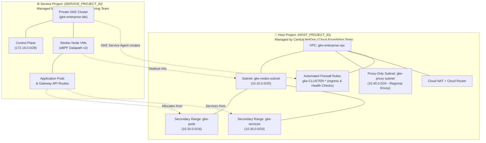
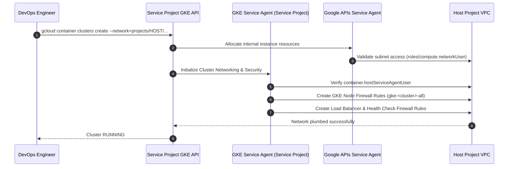

# Step 4: Enterprise Shared VPC Deep Dive

In enterprise Google Cloud architectures, network infrastructure and application workloads are strictly separated across projects. This is implemented using **Shared VPC**, where a centralized **Host Project** owns the network topology and one or more **Service Projects** host GKE clusters and workloads.

This guide walks through the complete setup of a GKE cluster on Shared VPC, explaining the security boundaries, service agents, and automated operations that happen **behind the scenes**.

---

## 1. Shared VPC Architecture & Separation of Concerns



### Roles and Responsibilities

| Dimension | Host Project (NetOps / Security) | Service Project (DevOps / SRE) |
| :--- | :--- | :--- |
| **GCP Project** | `HOST_PROJECT_ID` (e.g., `corp-net-hub`) | `SERVICE_PROJECT_ID` (e.g., `payments-gke-prod`) |
| **Ownership** | VPC, subnets, CIDRs, NAT, VPN/Interconnect, base firewalls | GKE clusters, node pools, Pods, Services, Gateways |
| **IAM Access** | Network Admin, Security Admin | Kubernetes Engine Admin, Workload Identity Users |
| **Billing** | Network egress and load balancer infrastructure charges | Compute Engine VM instances, persistent disks |

---

## 2. Behind the Scenes: The Service Agents & IAM Dance

When you run `gcloud container clusters create` in a Service Project against a Host Project VPC, GKE cannot succeed unless three critical service accounts have exact permissions in the **Host Project**:



### The Three Key Identities

1. **GKE Service Agent** (Service Project):
   - **Email format**: `service-${SERVICE_PROJECT_NUM}@container-engine-robot.iam.gserviceaccount.com`
   - **Required Host Project Role**: `roles/container.hostServiceAgentUser`
   - **What it does behind the scenes**:
     - Grants GKE in the service project permission to manage network resources in the host project.
     - Automatically creates and modifies firewall rules in the Host Project when you deploy `LoadBalancer` services, Gateways, or Network Policies.
     - Coordinates with Compute Engine to attach node NICs to shared subnets.

2. **Google APIs Service Agent** (Service Project):
   - **Email format**: `${SERVICE_PROJECT_NUM}@cloudservices.gserviceaccount.com`
   - **Required Subnet Role**: `roles/compute.networkUser`
   - **What it does behind the scenes**:
     - Performs resource provisioning tasks on behalf of the service project (e.g., instance creation, route injection).

3. **GKE Node Service Account**:
   - **Default or Custom SA**: `${NODE_SA_EMAIL}` (e.g., `gke-nodes-sa@${SERVICE_PROJECT_ID}.iam.gserviceaccount.com`)
   - **Required Subnet Role**: `roles/compute.networkUser`
   - **What it does behind the scenes**:
     - Allows the node VMs to attach their virtual network interfaces (vNICs) to the host subnet.

---

## 3. Step-by-Step Shared VPC Setup

### 3.1 Define Project Identifiers

```bash
export HOST_PROJECT_ID="my-gke-host-project"
export SERVICE_PROJECT_ID="my-gke-service-project"
export REGION="us-central1"
export ZONE="us-central1-a"
export VPC_NAME="gke-enterprise-vpc"
export SUBNET_NAME="gke-nodes-subnet"
export PROXY_SUBNET_NAME="gke-proxy-subnet"
export CLUSTER_NAME="gke-enterprise-lab"
```

Fetch the **Project Number** of the Service Project:

```bash
export SERVICE_PROJECT_NUM=$(gcloud projects describe ${SERVICE_PROJECT_ID} --format="value(projectNumber)")
echo "Service Project Number: ${SERVICE_PROJECT_NUM}"
```

---

### 3.2 Enable Shared VPC on the Host Project

As a **Shared VPC Admin** (requires `roles/compute.xpnAdmin` at the GCP Organization or Folder level):

```bash
# 1. Enable Host Project as a Shared VPC Host
gcloud compute shared-vpc enable ${HOST_PROJECT_ID}

# 2. Associate the Service Project with the Host Project
gcloud compute shared-vpc associated-projects add ${SERVICE_PROJECT_ID} \
    --host-project=${HOST_PROJECT_ID}
```

Verify the association:

```bash
gcloud compute shared-vpc get-host-project ${SERVICE_PROJECT_ID}
```

---

### 3.3 Ensure the GKE API Service Agent Exists

In the Service Project, initialize the Kubernetes Engine API so Google creates the GKE Service Agent:

```bash
gcloud services enable container.googleapis.com --project=${SERVICE_PROJECT_ID}
```

Check that the GKE Robot Service Account is generated:

```bash
export GKE_ROBOT_SA="service-${SERVICE_PROJECT_NUM}@container-engine-robot.iam.gserviceaccount.com"
export CLOUD_SERVICES_SA="${SERVICE_PROJECT_NUM}@cloudservices.gserviceaccount.com"

echo "GKE Service Agent: ${GKE_ROBOT_SA}"
echo "Google APIs SA:    ${CLOUD_SERVICES_SA}"
```

---

### 3.4 Grant IAM Roles in the Host Project

#### A. Grant `container.hostServiceAgentUser` to GKE Service Agent
This permission MUST be granted at the **Host Project level** (not just on a subnet):

```bash
gcloud projects add-iam-policy-binding ${HOST_PROJECT_ID} \
    --member="serviceAccount:${GKE_ROBOT_SA}" \
    --role="roles/container.hostServiceAgentUser"
```

#### B. Grant `compute.networkUser` on the Shared Subnet (Least Privilege)
Best practice recommends granting `networkUser` **only on the specific subnets** the GKE cluster will consume, rather than the entire host project:

```bash
# Grant to GKE Service Agent on Node Subnet
gcloud compute networks subnets add-iam-policy-binding ${SUBNET_NAME} \
    --project=${HOST_PROJECT_ID} \
    --region=${REGION} \
    --member="serviceAccount:${GKE_ROBOT_SA}" \
    --role="roles/compute.networkUser"

# Grant to Google APIs Service Agent on Node Subnet
gcloud compute networks subnets add-iam-policy-binding ${SUBNET_NAME} \
    --project=${HOST_PROJECT_ID} \
    --region=${REGION} \
    --member="serviceAccount:${CLOUD_SERVICES_SA}" \
    --role="roles/compute.networkUser"
```

#### C. Grant Access to Proxy-Only Subnet (for Gateway API)
If deploying Internal Application Load Balancers via Gateway API (`gke-l7-rilb`), grant `networkUser` on the **Proxy-Only Subnet**:

```bash
gcloud compute networks subnets add-iam-policy-binding ${PROXY_SUBNET_NAME} \
    --project=${HOST_PROJECT_ID} \
    --region=${REGION} \
    --member="serviceAccount:${GKE_ROBOT_SA}" \
    --role="roles/compute.networkUser"
```

---

### 3.5 Verify Subnet Usability from Service Project

Verify that the Service Project can see and consume the shared subnets:

```bash
gcloud compute networks subnets list-usable \
    --project=${SERVICE_PROJECT_ID} \
    --format="table(subnetwork.basename(), network.basename(), ipCidrRange, secondaryIpRanges[].rangeName.list():label=SECONDARY_RANGES)"
```

**Expected Output:**
```
SUB_NETWORK       NETWORK             IP_CIDR_RANGE  SECONDARY_RANGES
gke-nodes-subnet  gke-enterprise-vpc  10.10.0.0/20   ['gke-pods', 'gke-services']
gke-proxy-subnet  gke-enterprise-vpc  10.40.0.0/24   []
```

---

## 4. Provisioning the GKE Cluster on Shared VPC

Now switch context to the **Service Project** and create the cluster. Notice that `--network` and `--subnetwork` point to the full resource URIs in the **Host Project**:

```bash
gcloud container clusters create ${CLUSTER_NAME} \
    --project=${SERVICE_PROJECT_ID} \
    --zone=${ZONE} \
    --release-channel=regular \
    --num-nodes=3 \
    --enable-ip-alias \
    --network="projects/${HOST_PROJECT_ID}/global/networks/${VPC_NAME}" \
    --subnetwork="projects/${HOST_PROJECT_ID}/regions/${REGION}/subnetworks/${SUBNET_NAME}" \
    --cluster-secondary-range-name="gke-pods" \
    --services-secondary-range-name="gke-services" \
    --enable-private-nodes \
    --enable-private-endpoint \
    --master-ipv4-cidr="172.16.0.0/28" \
    --enable-master-authorized-networks \
    --master-authorized-networks="10.10.0.0/20" \
    --dataplane-v2 \
    --gateway-api=standard \
    --enable-shielded-nodes \
    --workload-pool="${SERVICE_PROJECT_ID}.svc.id.goog"
```

---

## 5. What GKE Does in the Host Project (Deep Dive)

As soon as the command runs, observe the actions triggered in the Host Project:

### 1. Automated Firewall Creation
Inspect the firewall rules created in the Host Project:

```bash
gcloud compute firewall-rules list \
    --project=${HOST_PROJECT_ID} \
    --filter="network:${VPC_NAME} AND name:gke-${CLUSTER_NAME}*" \
    --format="table(name, direction, priority, sourceRanges.list():label=SOURCES, allowed[].map().firewall_rule().list():label=RULES)"
```

You will see rules dynamically created by the `container-engine-robot`:
- **`gke-<cluster>-<hash>-all`**: Permits all pod-to-pod and node-to-node traffic across the primary and secondary CIDRs.
- **`gke-<cluster>-<hash>-vms`**: Permits internal communication between cluster worker nodes.
- **Health check rules**: When a Gateway or Service is created, the GKE controller creates ingress rules from Google health check ranges (`130.211.0.0/22`, `35.191.0.0/16`).

### 2. Control Plane Peering & Private Service Connect
- The GKE Control Plane runs in a Google-managed tenant project.
- In Shared VPC, the control plane communicates with worker nodes in the Host Project VPC using **Private Service Connect (PSC)** or VPC Network Peering.
- The `--master-ipv4-cidr` (`172.16.0.0/28`) routes directly through the Host VPC routing table without conflicting with your internal corporate IP addresses.

---

## 6. Common DevOps Troubleshooting Pitfalls

### Pitfall 1: `Required 'compute.firewalls.create' permission for 'projects/HOST_PROJECT'`
- **Symptom**: Cluster creation fails during node provisioning or Service type `LoadBalancer` creation hangs indefinitely.
- **Root Cause**: The GKE Service Agent was granted `compute.networkUser` but lacks `roles/container.hostServiceAgentUser` at the **Host Project** level.
- **Fix**:
  ```bash
  gcloud projects add-iam-policy-binding ${HOST_PROJECT_ID} \
      --member="serviceAccount:service-${SERVICE_PROJECT_NUM}@container-engine-robot.iam.gserviceaccount.com" \
      --role="roles/container.hostServiceAgentUser"
  ```

### Pitfall 2: `Subnetwork is not accessible by service project`
- **Symptom**: `gcloud container clusters create` returns `ERROR: (gcloud.container.clusters.create) ResponseError: code=400, message=Subnetwork ... cannot be accessed`.
- **Root Cause**: Subnet-level IAM permissions were granted to the wrong service account or the Google APIs SA was omitted.
- **Fix**: Verify with `gcloud compute networks subnets list-usable --project=${SERVICE_PROJECT_ID}`. Ensure both the GKE Service Agent and the Google APIs SA (`${SERVICE_PROJECT_NUM}@cloudservices.gserviceaccount.com`) have `roles/compute.networkUser`.

### Pitfall 3: Gateway API Proxy Subnet Missing
- **Symptom**: HTTPRoute reports `ResolvedRefs: False` with error `no proxy-only subnet found in region`.
- **Root Cause**: The Host Project has not provisioned a subnet with `--purpose=REGIONAL_MANAGED_PROXY` in the matching region, or the GKE Service Agent cannot access it.
- **Fix**: Ensure the Proxy-Only subnet is created in the Host Project and `roles/compute.networkUser` is granted to the GKE Service Agent.

---

## ⏭️ Summary & Best Practices

| Best Practice | Implementation |
| :--- | :--- |
| **Least Privilege Subnet Sharing** | Share individual subnets rather than the entire Host Project with `roles/compute.networkUser`. |
| **Dedicated Service Accounts** | Always assign custom Node Service Accounts with minimal scopes instead of the Compute default SA. |
| **Proxy-Only Subnet Sizing** | Allocate at least a `/24` (256 IPs) in the Host Project for regional Envoy proxies to prevent scaling bottlenecks. |
| **Centralized NAT & Firewall Baseline** | Maintain corporate egress security and inspection in the Host Project while giving Service Projects self-service workload isolation. |

---

## ⏭️ Next Step
Proceed to [**Module 2: Networking Fundamentals**](../02-networking-fundamentals/index.md) to explore VPC-native alias IPs, eBPF packet routing, and Cloud DNS for GKE.

