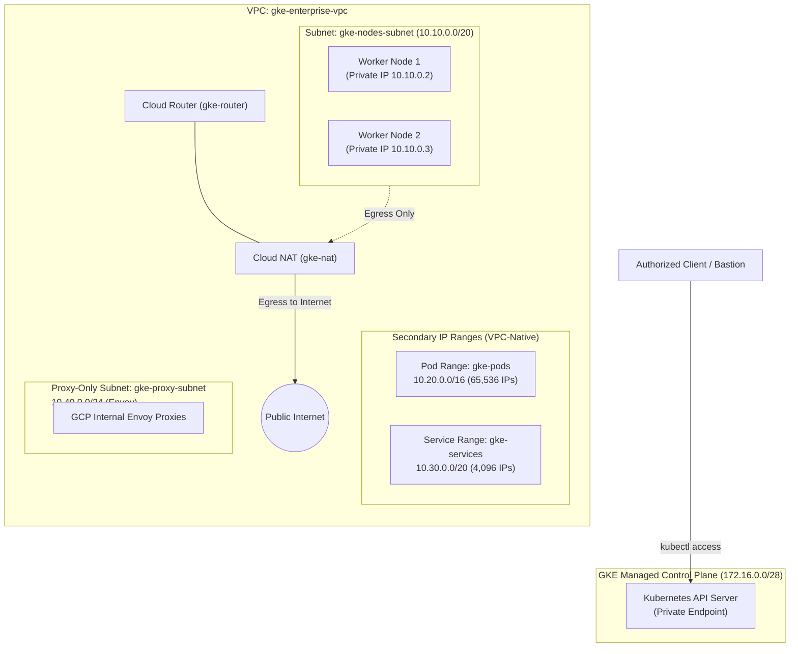

# Module 1: Enterprise Cluster Setup

In this module, you will design and provision the enterprise networking foundation and spin up a production-grade private Google Kubernetes Engine (GKE) cluster.

---

## 🎯 Objectives

1. Create a custom Google Cloud Virtual Private Cloud (VPC) network.
2. Configure primary subnet CIDRs and secondary IP alias ranges for GKE Pods and Services.
3. Configure a **Proxy-Only Subnet** required by Google Cloud Internal Application Load Balancers (Envoy proxies for Gateway API).
4. Deploy a **Cloud Router** and **Cloud NAT** to allow private worker nodes and pods to securely access the public internet (for image pulls and external APIs) without possessing public IP addresses.
5. Provision a **Private GKE Cluster** with Datapath v2 (eBPF/Cilium), Gateway API, Workload Identity, Shielded GKE Nodes, and Private Master Endpoint.
6. Configure access to the cluster using Master Authorized Networks or an IAP-tunneled bastion host.
7. Understand and deploy multi-project **Enterprise Shared VPC** architecture, service agents, and automated firewall provisioning.

---

## 📐 Architecture Blueprint

---

## 📂 Module Steps

Follow the steps in order:

1. [**Step 1: VPC, Subnets & Cloud NAT**](01-vpc-and-nat.md) - Configure custom network topology, IPAM ranges, and egress NAT.
2. [**Step 2: Provisioning Private GKE Cluster**](02-private-cluster.md) - Execute the comprehensive `gcloud` command to spin up the cluster with Datapath v2 and Gateway API.
3. [**Step 3: Cluster Access & Bastion Configuration**](03-access-and-bastion.md) - Configure Master Authorized Networks, IAP tunneling, and establish `kubectl` connectivity.
4. [**Step 4: Enterprise Shared VPC Deep Dive**](04-shared-vpc.md) - Host vs Service Project architecture, IAM service agents, least-privilege subnet sharing, and behind-the-scenes automation.

