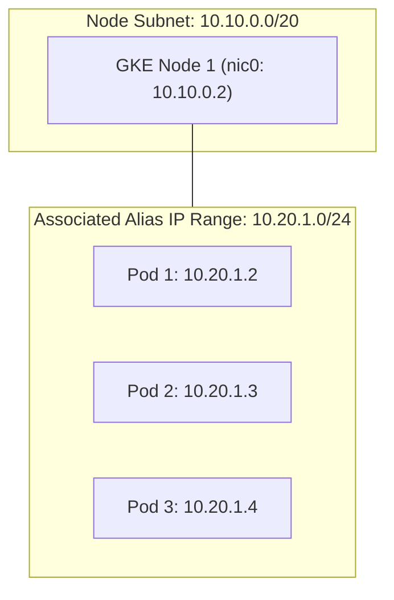

# Step 1: IPAM & Alias IPs

In a **VPC-Native** GKE cluster, Pods receive Google Cloud Virtual Private Cloud (VPC) **Alias IP addresses**. This means Pod IP addresses are native, first-class citizens in your Google Cloud VPC network.

---

## 1. How Alias IP Allocation Works

When a node is provisioned in a VPC-native cluster:
1. GKE assigns the node a primary IP from the node subnet (e.g., `10.10.0.2` from `10.10.0.0/20`).
2. GKE carves out a slice (by default, a `/24` block containing 256 IP addresses) from the secondary range `gke-pods` (`10.20.0.0/16`) and associates it as an **alias IP range** on the node's virtual network interface (`nic0`).
3. When Pods are scheduled on that node, the container runtime assigns IP addresses directly from this `/24` range to each Pod's network interface (`eth0`).



---

## 2. Hands-on Inspection: Node Pod CIDRs

Inspect the Pod CIDR assigned to each node in your cluster:

```bash
kubectl get nodes -o custom-columns=\
NAME:.metadata.name,\
INTERNAL_IP:.status.addresses[?\(@.type==\"InternalIP\"\)].address,\
POD_CIDR:.spec.podCIDR
```

**Expected Output:**
```
NAME                                            INTERNAL_IP   POD_CIDR
gke-gke-enterprise-lab-default-pool-a1b2-1111   10.10.0.2     10.20.0.0/24
gke-gke-enterprise-lab-default-pool-a1b2-2222   10.10.0.3     10.20.1.0/24
gke-gke-enterprise-lab-default-pool-a1b2-3333   10.10.0.4     10.20.2.0/24
```

Each node is allocated its own `/24` CIDR from the `10.20.0.0/16` range.

---

## 3. Verify Alias IP in Compute Engine

Inspect the underlying Compute Engine instance corresponding to one of the nodes to see how GCP implements this at the infrastructure layer:

```bash
NODE_INSTANCE=$(kubectl get nodes -o jsonpath='{.items[0].metadata.name}')

gcloud compute instances describe ${NODE_INSTANCE} \
    --zone=${ZONE} \
    --format="yaml(networkInterfaces[0].aliasIpRanges)"
```

**Expected Output:**
```yaml
networkInterfaces:
- aliasIpRanges:
  - ipCidrRange: 10.20.0.0/24
    subnetworkRangeName: gke-pods
```

> [!NOTE]
> Because Google Cloud's Software Defined Network (Andromeda) understands this alias IP mapping, any VM or service inside the VPC can send traffic directly to `10.20.0.x` without needing an overlay network (like VXLAN or Geneve) or SNAT.

---

## 4. Deploying a Test Workload

Deploy a multi-replica NGINX workload to observe how Pod IPs are distributed across nodes:

```bash
kubectl create namespace fundamentals-lab
kubectl apply -n fundamentals-lab -f - <<EOF
apiVersion: apps/v1
kind: Deployment
metadata:
  name: echo-workload
spec:
  replicas: 4
  selector:
    matchLabels:
      app: echo-workload
  template:
    metadata:
      labels:
        app: echo-workload
    spec:
      containers:
      - name: web
        image: registry.k8s.io/echoserver:1.10
        ports:
        - containerPort: 8080
EOF
```

Wait for pods to be ready:
```bash
kubectl wait --namespace fundamentals-lab \
  --for=condition=ready pod \
  --selector=app=echo-workload \
  --timeout=60s
```

Inspect Pod IP assignments:
```bash
kubectl get pods -n fundamentals-lab -o wide
```

**Sample Output:**
```
NAME                             READY   STATUS    IP          NODE
echo-workload-747688467b-4lqwp   1/1     Running   10.20.1.4   gke-gke-enterprise-lab-default-pool-a1b2-2222
echo-workload-747688467b-8dfjk   1/1     Running   10.20.0.5   gke-gke-enterprise-lab-default-pool-a1b2-1111
echo-workload-747688467b-m7kql   1/1     Running   10.20.2.3   gke-gke-enterprise-lab-default-pool-a1b2-3333
echo-workload-747688467b-vx92x   1/1     Running   10.20.1.5   gke-gke-enterprise-lab-default-pool-a1b2-2222
```

Notice that each Pod IP matches the `podCIDR` of the node on which it was scheduled.

---

## 5. Enterprise IP Planning Considerations

When planning VPC-native subnets for large enterprises, keep these constraints in mind:

1. **Max Pods Per Node**: By default, GKE allocates a `/24` (256 addresses) per node to support a maximum of 110 pods per node (2x IP buffer for zero-downtime rolling upgrades).
2. **Flexible Pod CIDR**: If your cluster runs nodes with fewer pods (e.g. 32 pods per node), you can optimize IP usage during cluster or node pool creation with `--max-pods-per-node=32`, which allocates a smaller `/26` (64 addresses) per node instead of `/24`, saving significant IP space.
3. **Disjoint Secondary Ranges**: In multi-cluster setups, each cluster should preferably use unique Pod and Service secondary ranges to prevent overlapping IP collisions when peering VPCs or interconnecting on-premises networks.

---

## ⏭️ Next Step
Proceed to [**Step 2: Datapath v2 (eBPF & Cilium)**](02-datapath-v2.md) to explore how eBPF routes packets without iptables.

