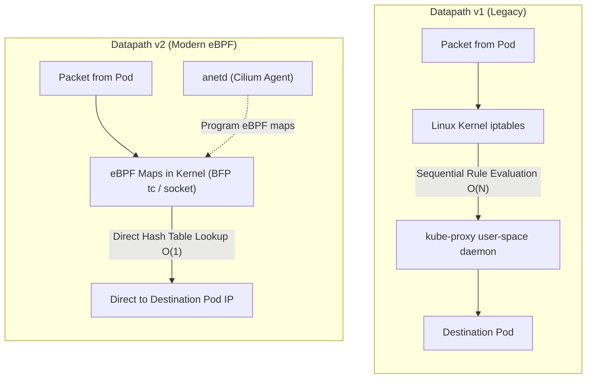

# Step 2: Datapath v2 (eBPF & Cilium)

Google Kubernetes Engine **Datapath v2** is the modern networking data plane built on **eBPF** (extended Berkeley Packet Filter) and **Cilium**. In Datapath v2, traditional `kube-proxy` and Linux `iptables` chains are completely replaced.

---

## 1. Datapath v1 (iptables) vs Datapath v2 (eBPF)



| Characteristic | Datapath v1 (iptables) | Datapath v2 (eBPF / Cilium) |
| :--- | :--- | :--- |
| **Service Routing** | Sequential iptables rule traversal (`O(N)`) | eBPF BPF Maps hash lookup (`O(1)`) |
| **Scale Performance** | High CPU overhead with 5,000+ Services | Flat CPU usage up to 100,000+ endpoints |
| **Network Policies** | iptables chains (`KUBE-SERVICES`, `KUBE-FIREWALL`) | In-kernel eBPF bytecode filtering |
| **Network Observability**| Basic connection tracking (conntrack) | Hubble-compatible flow logging and metrics |
| **Source IP Preservation** | Often lost due to SNAT in iptables | Preserved end-to-end natively |

---

## 2. Inspecting the Datapath v2 DaemonSet (`anetd`)

In GKE Datapath v2, the agent running on every node is named `anetd` (Advanced Network Telemetry Daemon), which embeds Cilium. 

> [!NOTE]
> Even though the DaemonSet is named `anetd`, GKE Datapath v2 is built on Cilium and uses the pod selector label **`k8s-app=cilium`**. You can verify this with:
> `kubectl get daemonset anetd -n kube-system -o jsonpath='{.spec.selector.matchLabels}'`

Check the pods of the `anetd` DaemonSet using the `k8s-app=cilium` label:

```bash
kubectl get pods -n kube-system -l k8s-app=cilium -o wide
```

**Expected Output:**
```
NAME          READY   STATUS    RESTARTS   AGE   IP          NODE
anetd-4t8lm   2/2     Running   0          25m   10.10.0.3   gke-gke-enterprise-lab-default-pool-a1b2-2222
anetd-7d8jk   2/2     Running   0          25m   10.10.0.4   gke-gke-enterprise-lab-default-pool-a1b2-3333
anetd-m5zqx   2/2     Running   0          25m   10.10.0.2   gke-gke-enterprise-lab-default-pool-a1b2-1111
```

Each `anetd` pod runs two containers:
1. `cilium-agent`: Compiles and loads eBPF programs into the Linux kernel and populates BPF maps for Services, Endpoints, and NetworkPolicies.
2. `cilium-cni`: Configures network interfaces and IP routing for new Pods.

---

## 3. Inspecting Cilium BPF Service Maps

View the startup and reconciliation logs from one of the `anetd` pods:

```bash
ANETD_POD=$(kubectl get pods -n kube-system -l k8s-app=cilium -o jsonpath='{.items[0].metadata.name}')

kubectl logs -n kube-system ${ANETD_POD} -c cilium-agent | grep -E "level=(info|warning)" | tail -n 20
```

To see how `anetd` detects and programs services into eBPF maps:

```bash
kubectl logs -n kube-system ${ANETD_POD} -c cilium-agent | grep -i "datapath" | head -n 10
```

---

## 4. Hands-on Experiment: eBPF Service Translation

When a Pod sends a request to a Kubernetes Service (ClusterIP), `iptables` does not intercept it. Instead, an eBPF program attached to the `connect()` system call (`sock_ops` / `cgroup2`) intercepts the socket connection at the container level and translates the destination virtual ClusterIP directly to the backend Pod IP before the packet even leaves the socket layer!

Let's test this in the next step when we deploy Services and observe latency and packet routing.

---

## ⏭️ Next Step
Proceed to [**Step 3: Cloud DNS for GKE**](03-gke-dns.md) to inspect intra-cluster DNS and service discovery.

