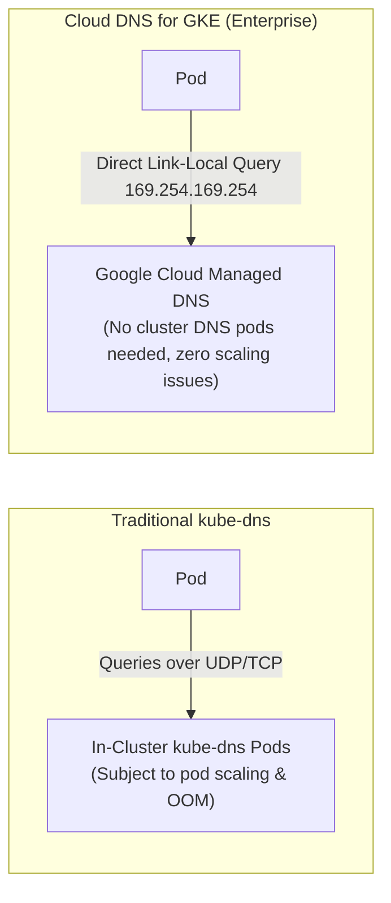

# Step 3: Cloud DNS for GKE & Service Discovery

Domain Name System (DNS) is the backbone of microservice discovery in Kubernetes. In GKE, you can choose between traditional in-cluster DNS (`kube-dns` / `CoreDNS`) or fully managed **Cloud DNS for GKE**.

---

## 1. Comparing DNS Architectures



| Feature | In-Cluster kube-dns | Cloud DNS for GKE |
| :--- | :--- | :--- |
| **Management** | Runs as Kubernetes Pods | Fully managed by Google Cloud |
| **Scaling** | Must scale replica count with cluster size | Automatically scales with VPC infra |
| **VPC-Scope** | Records only resolvable inside cluster | Records resolvable across entire VPC (with VPC-scope) |
| **Failures** | DNS pod restarts cause resolution timeouts | High-availability Google infrastructure |

---

## 2. Hands-on DNS Inspection

Deploy an interactive networking utility pod (`dnsutils`):

```bash
kubectl apply -n fundamentals-lab -f - <<EOF
apiVersion: v1
kind: Pod
metadata:
  name: dnsutils
spec:
  containers:
  - name: dnsutils
    image: registry.k8s.io/e2e-test-images/jessie-dnsutils:1.3
    command:
      - sleep
      - "3600"
    imagePullPolicy: IfNotPresent
EOF
```

Wait for the pod to be running:
```bash
kubectl wait --namespace fundamentals-lab \
  --for=condition=ready pod/dnsutils \
  --timeout=60s
```

### 2.1 Inspect `/etc/resolv.conf`
Inspect the DNS resolver configuration injected into the Pod:

```bash
kubectl exec -n fundamentals-lab -it dnsutils -- cat /etc/resolv.conf
```

**Expected Output:**
```
nameserver 10.30.0.10
search fundamentals-lab.svc.cluster.local svc.cluster.local cluster.local c.your-project.internal google.internal
options ndots:5
```

Notice:
1. `nameserver 10.30.0.10`: The 10th IP in the `gke-services` secondary range (`10.30.0.0/20`), reserved for the cluster DNS service.
2. `search`: The sequential search suffixes evaluated for non-fully-qualified domain names.
3. `options ndots:5`: If a queried domain contains fewer than 5 dots (e.g. `api.service.internal`), the resolver appends each search domain sequentially before querying the root domain.

---

## 3. Resolving Kubernetes Services

Expose the `echo-workload` deployment created in Step 1 as a ClusterIP Service:

```bash
kubectl expose deployment echo-workload \
    -n fundamentals-lab \
    --name=echo-service \
    --port=80 \
    --target-port=8080
```

Query the service using `nslookup`:

```bash
kubectl exec -n fundamentals-lab -it dnsutils -- nslookup echo-service
```

**Expected Output:**
```
Server:    10.30.0.10
Address 1: 10.30.0.10 kube-dns.kube-system.svc.cluster.local

Name:      echo-service.fundamentals-lab.svc.cluster.local
Address 1: 10.30.x.x echo-service.fundamentals-lab.svc.cluster.local
```

### 3.1 Resolving Fully Qualified Domain Names (FQDN)
In Kubernetes, the full FQDN format for any service is:
```
<service-name>.<namespace>.svc.cluster.local
```

Test querying across namespaces:
```bash
kubectl exec -n fundamentals-lab -it dnsutils -- nslookup echo-service.fundamentals-lab.svc.cluster.local
```

---

## 4. Enterprise Best Practice: Mitigating `ndots:5` DNS Latency

Because `ndots:5` is default, an external query like `curl https://api.github.com` generates 4 unnecessary internal failed queries before resolving externally:
1. `api.github.com.fundamentals-lab.svc.cluster.local` (NXDOMAIN)
2. `api.github.com.svc.cluster.local` (NXDOMAIN)
3. `api.github.com.cluster.local` (NXDOMAIN)
4. `api.github.com.c.your-project.internal` (NXDOMAIN)
5. `api.github.com` (SUCCESS)

### Solution:
In latency-critical production workloads, add a trailing dot to external hostnames (e.g., `api.github.com.`) or customize the pod's `dnsConfig` in the Deployment spec:

```yaml
spec:
  dnsConfig:
    options:
      - name: ndots
        value: "2"
```

---

## ⏭️ Next Step
Proceed to [**Module 3: Services & Load Balancing Deep Dive**](../03-services-and-load-balancing/index.md) to explore how services route traffic and how Network Endpoint Groups (NEGs) eliminate double-hopping.

