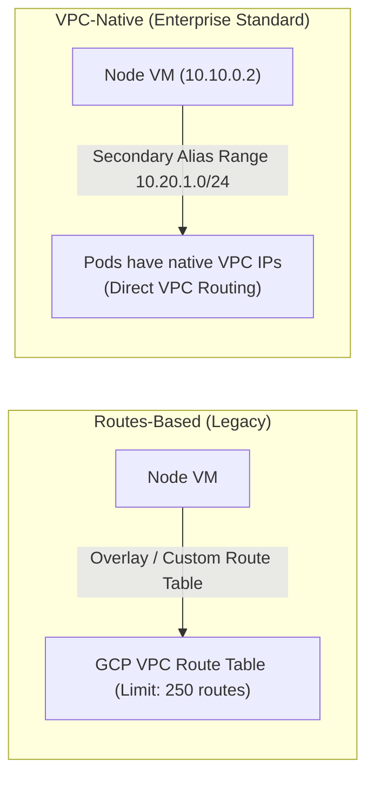

# Module 2: GKE Networking Fundamentals

Understanding the low-level data plane and control plane mechanics in GKE is essential for designing resilient enterprise platforms and diagnosing network incidents.

---

## 🎯 Objectives

1. **IP Address Management (IPAM)**: Inspect how VPC-native alias IPs allocate `/24` Pod CIDRs per node and route Pod traffic natively through Google Cloud VPC without overlay encapsulation.
2. **Datapath v2 (eBPF & Cilium)**: Understand how eBPF programs replace `kube-proxy` and `iptables` at the Linux kernel socket and tc (traffic control) layers.
3. **Cloud DNS for GKE**: Examine intra-cluster DNS resolution, service lookup records (`<svc>.<ns>.svc.cluster.local`), and compare kube-dns vs Cloud DNS VPC scope.
4. **Packet Walk Tracing**: Perform hands-on packet walks for Pod-to-Pod (same node vs cross-node) and Pod-to-External scenarios.

---

## 🧭 Architecture Comparison: Routes-Based vs VPC-Native

---

## 📂 Module Steps

1. [**Step 1: IPAM & Alias IPs**](01-ipam-and-alias-ips.md) - Examine secondary IP allocation, per-node CIDR blocks, and alias IP routing tables.
2. [**Step 2: Datapath v2 (eBPF & Cilium)**](02-datapath-v2.md) - Deep-dive into Cilium eBPF packet processing, `anetd`, and kernel-level service translation.
3. [**Step 3: Cloud DNS for GKE**](03-gke-dns.md) - Explore service discovery, DNS caching, search paths, and DNS query troubleshooting.

