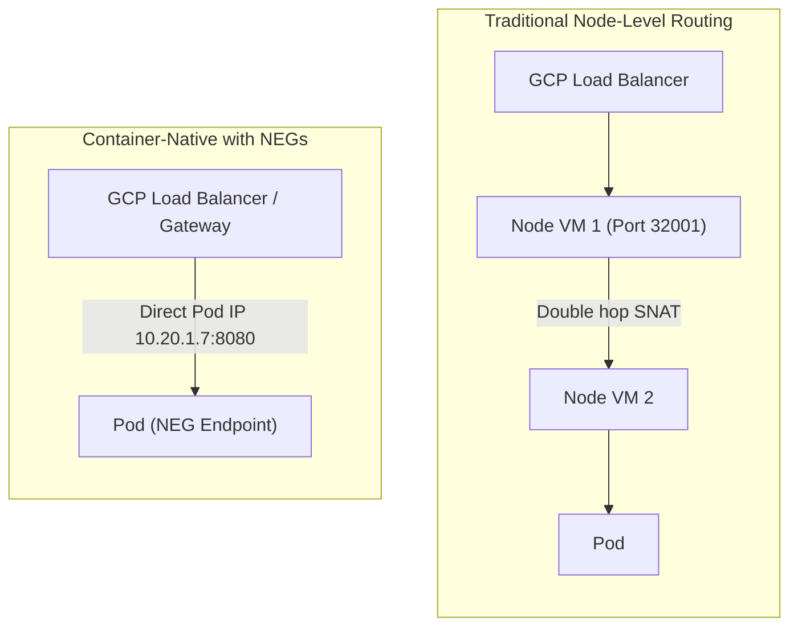

# Step 3: Container-Native Load Balancing (NEGs)

**Container-Native Load Balancing** is the enterprise standard for GKE. Instead of routing traffic through intermediate NodePorts and relying on `kube-proxy` or iptables to forward packets to pods on other nodes, Google Cloud Load Balancers program **Network Endpoint Groups (NEGs)** that target Pod IP addresses directly.

---

## 1. Why Container-Native Load Balancing?



### Advantages:
1. **Zero Double-Hop Latency**: Traffic goes directly from the Google Cloud load balancer / Envoy proxy to the target Pod's network interface.
2. **True Health Checking**: Google Cloud health checks probe the Pod itself (e.g. at `/healthz`). If a Pod is failing or dead, the load balancer immediately stops sending traffic to that specific Pod, even if the host node VM is healthy.
3. **Client IP Preservation**: The client's true IP address is preserved without needing complex `externalTrafficPolicy: Local` workarounds.
4. **Even Traffic Distribution**: Requests are balanced evenly across all Pods, regardless of how many Pods reside on each node.

---

## 2. Deploying a Standalone NEG Service

Apply the manifest located at `manifests/03-services/neg-service.yaml`:

```bash
kubectl apply -f manifests/03-services/neg-service.yaml
```

Wait for the deployment to roll out:

```bash
kubectl rollout status deployment/neg-workload -n services-lab
```

---

## 3. Inspecting the NEG Annotation & Status

When the GKE NEG controller reads `cloud.google.com/neg: '{"exposed_ports": {"80":{}}}'`, it creates a Google Cloud Zonal NEG and injects an annotation back into the Service metadata.

Inspect the annotations on `neg-service`:

```bash
kubectl get svc neg-service -n services-lab -o jsonpath='{.metadata.annotations}' | jq .
```

**Expected Output:**
```json
{
  "cloud.google.com/neg": "{\"exposed_ports\": {\"80\":{}}}",
  "cloud.google.com/neg-status": "{\"network_endpoint_groups\":{\"80\":\"k8s1-9a1c4321-services-lab-neg-service-80-69251da8\"},\"zones\":[\"us-central1-a\"]}"
}
```

Notice the `cloud.google.com/neg-status` annotation containing the auto-generated GCP NEG name!

---

## 4. Inspecting Endpoints in Google Cloud

Query the Google Cloud Compute Engine API to see the actual Network Endpoint Group:

```bash
NEG_NAME=$(kubectl get svc neg-service -n services-lab -o jsonpath='{.metadata.annotations.cloud\.google\.com/neg-status}' | jq -r '.network_endpoint_groups."80"')

gcloud compute network-endpoint-groups describe ${NEG_NAME} \
    --zone=${ZONE} \
    --project=${PROJECT_ID}
```

**Expected Output:**
```yaml
kind: compute#networkEndpointGroup
name: k8s1-9a1c4321-services-lab-neg-service-80-69251da8
network: https://www.googleapis.com/compute/v1/projects/.../networks/gke-enterprise-vpc
networkEndpointType: GCE_VM_IP_PORT
size: 3
subnetwork: https://www.googleapis.com/compute/v1/projects/.../subnetworks/gke-nodes-subnet
zone: https://www.googleapis.com/compute/v1/projects/.../zones/us-central1-a
```

List the endpoints (Pod IPs and ports) registered in this NEG:

```bash
gcloud compute network-endpoint-groups list-network-endpoints ${NEG_NAME} \
    --zone=${ZONE} \
    --project=${PROJECT_ID}
```

**Expected Output:**
```
INSTANCE                                       IP_ADDRESS   PORT
gke-gke-enterprise-lab-default-pool-a1b2-1111  10.20.0.6    8080
gke-gke-enterprise-lab-default-pool-a1b2-2222  10.20.1.7    8080
gke-gke-enterprise-lab-default-pool-a1b2-3333  10.20.2.5    8080
```

Notice that the `IP_ADDRESS` values correspond directly to the Pod IP addresses in the `gke-pods` secondary range (`10.20.0.0/16`)!

---

## 5. Summary

| Metric | Traditional NodePort | Container-Native NEG |
| :--- | :--- | :--- |
| **Target** | Node VM IP + Port (30000-32767) | Direct Pod IP + Container Port |
| **Network Hops** | 2 hops (LB -> Node -> iptables -> Pod) | 1 hop (LB -> Pod) |
| **Health Checks** | Checks kube-proxy node health | Checks individual Pod application health |
| **Primary Integration** | Legacy GCP External LBs | Gateway API & Ingress (`gke-l7-rilb`, `gke-l7-gxlb`) |

---

## ⏭️ Next Step
Proceed to [**Module 4: GKE Gateway API**](../04-gateway-api/index.md) to learn how the modern Kubernetes Gateway API leverages NEGs for advanced Layer 7 traffic routing.

