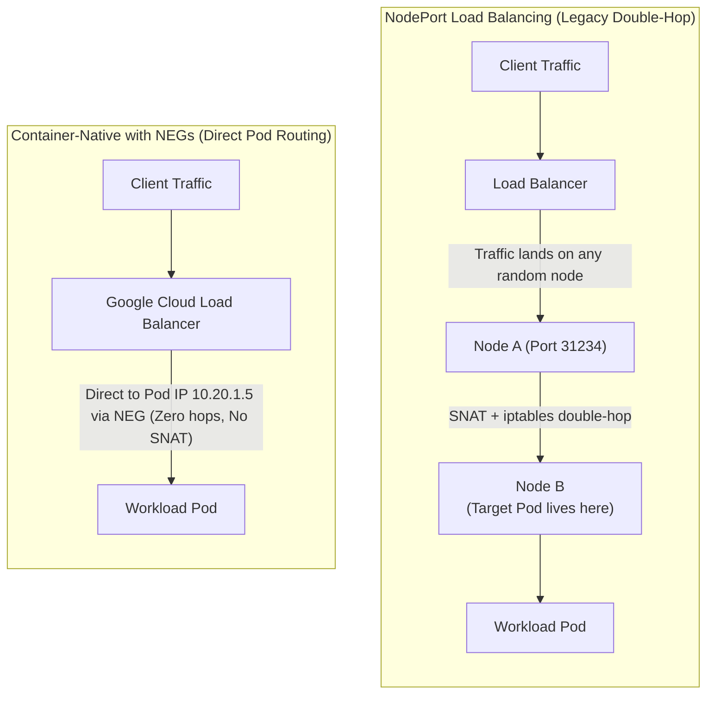

# Module 3: Kubernetes Services & Load Balancing

In this module, you will examine the full spectrum of Kubernetes Service types and Google Cloud Load Balancer integrations in GKE, contrasting legacy instance-based routing with modern **Container-Native Load Balancing via Network Endpoint Groups (NEGs)**.

---

## 🎯 Objectives

1. **ClusterIP & Headless Services**: Understand virtual IP packet flows, stateful service discovery with SRV records, and direct pod addressability.
2. **Internal TCP/UDP Load Balancer (L4 ILB)**: Deploy private regional L4 Passthrough Load Balancers using GKE Service annotations (`cloud.google.com/load-balancer-type: "Internal"`).
3. **Container-Native Load Balancing (NEGs)**: Compare NodePort double-hop routing vs Standalone Network Endpoint Groups (NEGs) that target Pod IPs directly.
4. **Source IP Preservation & Health Checking**: Observe how container-native load balancing delivers direct health checks to Pods and preserves original client IP addresses.

---

## 🧭 Architecture: NodePort vs Container-Native NEG

---

## 📂 Module Steps

1. [**Step 1: ClusterIP & Headless Services**](01-clusterip-and-headless.md) - Deep dive into standard virtual IPs and Headless stateful service discovery.
2. [**Step 2: Internal TCP/UDP Load Balancing**](02-internal-lb.md) - Deploy private Layer 4 load balancing for internal microservices.
3. [**Step 3: Container-Native Load Balancing (NEGs)**](03-negs-container-native.md) - Deploy Standalone NEGs and inspect Google Cloud Network Endpoint Groups.

