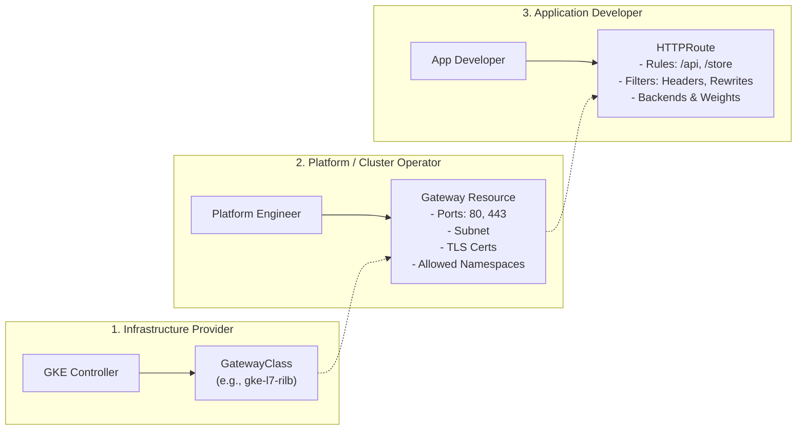

# Step 1: Gateway Concepts & Architecture

The Kubernetes **Gateway API** was created by the Kubernetes Network SIG to address the design limitations of the legacy `Ingress` resource.

---

## 1. Why Gateway API Replaces Ingress

| Limitation of Ingress | Gateway API Solution |
| :--- | :--- |
| **Monolithic Specification**: A single Ingress manifest mixed load balancer IP/ports, TLS certificates, and application routing paths. | **Role-Oriented Separation**: Distinct resources for Platform Engineers (`Gateway`) and Application Developers (`HTTPRoute`). |
| **Heavy Reliance on Custom Annotations**: Features like traffic splitting, rewrites, and timeouts required non-standard annotations (`nginx.ingress.kubernetes.io/...`). | **Native Standardized Fields**: Header filtering, URL rewriting, traffic weighting, and mirroring are built directly into the spec. |
| **Cross-Namespace Anti-Patterns**: Sharing an Ingress across namespaces was insecure and error-prone. | **Decoupled Cross-Namespace Routing**: Gateways in one namespace can cleanly bind to HTTPRoutes in other namespaces using `allowedRoutes` and `ReferenceGrant`. |

---

## 2. Personas & Resource Separation

### The Three Roles:
1. **Infrastructure Provider** (Google Cloud / GKE): Installs the Gateway controller and defines `GatewayClass` resources.
2. **Platform Operator**: Deploys `Gateway` objects that declare the IP addresses, ports, protocols, and TLS certificates for entry points into the cluster.
3. **Application Developer**: Deploys `HTTPRoute` objects attached to the Gateway to route traffic to their specific Services.

---

## 3. GKE Supported GatewayClasses

GKE natively includes several production GatewayClasses:

| GatewayClass Name | GCP Load Balancer Architecture | Scope | Primary Use Case |
| :--- | :--- | :--- | :--- |
| `gke-l7-rilb` | Regional Internal Application Load Balancer | Single Cluster, VPC-internal | Private enterprise microservices, internal APIs |
| `gke-l7-gxlb` | Global External Application Load Balancer | Single Cluster, Public internet | Internet-facing apps, Global Anycast IP, Cloud Armor |
| `gke-l7-rilb-mc` | Multi-Cluster Regional Internal ALB | Multi-Cluster, VPC-internal | High-availability internal apps spanning clusters |
| `gke-l7-gxlb-mc` | Multi-Cluster Global External ALB | Multi-Cluster, Public internet | Multi-region, geo-routed external web applications |

> [!NOTE]
> In this lab, we focus on **`gke-l7-rilb`**, which implements Google Cloud's high-performance Envoy proxies inside our private `gke-proxy-subnet` (`10.40.0.0/24`).

---

## ⏭️ Next Step
Proceed to [**Step 2: Internal Application Gateway (`gke-l7-rilb`)**](02-internal-gateway.md) to provision a private Gateway and inspect the allocated Google Cloud Envoy proxy.

