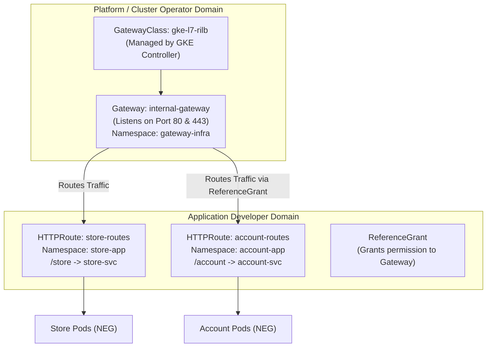

# Module 4: GKE Gateway API

The **Kubernetes Gateway API** (`gateway.networking.k8s.io`) is the modern evolution of Kubernetes Ingress. It provides an expressive, extensible, and role-oriented standard for Layer 7 traffic routing and load balancing in GKE.

---

## 🎯 Objectives

1. **Understand Gateway API Role Separation**: Learn how `GatewayClass` (Cloud/Infra Provider), `Gateway` (Cluster Operator), and `HTTPRoute` (Application Developer) divide ownership cleanly.
2. **Deploy an Internal Application Load Balancer Gateway**: Provision a private `gke-l7-rilb` Gateway backed by Google Cloud Envoy proxies and the proxy-only subnet.
3. **Advanced L7 Routing**: Configure URL prefix matching, query parameters, header transformations, and HTTP redirects.
4. **Cross-Namespace Routing with `ReferenceGrant`**: Route incoming traffic from a central Gateway in an ingress namespace to backend services across different application namespaces securely.
5. **TLS Termination**: Configure secure HTTPS listeners using Kubernetes Secrets or Google-managed certificates.

---

## 🏛️ Gateway API Architecture

---

## 📂 Module Steps

1. [**Step 1: Gateway Concepts & Architecture**](01-gateway-concepts.md) - Deep dive into Gateway API resources, persona separation, and comparison with Ingress.
2. [**Step 2: Internal Application Gateway (`gke-l7-rilb`)**](02-internal-gateway.md) - Deploy the private regional Gateway and inspect Envoy proxy binding.
3. [**Step 3: Advanced Routing, Rewrites & TLS**](03-routing-and-tls.md) - Configure path routing, header rewrites, redirect rules, and cross-namespace `ReferenceGrant`.

