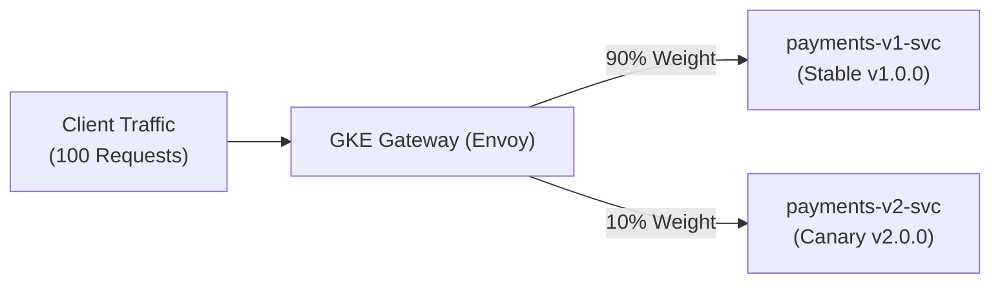

# Step 1: Canary Deployments with Gateway API

A **Canary Deployment** introduces a new software release to a small fraction of users (e.g. 10%) while the majority (90%) continues receiving the stable version.

In the Kubernetes Gateway API, traffic weighting is a native first-class feature of `backendRefs[].weight`.

---

## 1. How Canary Weighting Works



When Google Cloud's Envoy proxy evaluates an HTTPRoute with multiple `backendRefs`, it calculates the relative probability:
$$\text{Traffic Share}(i) = \frac{\text{weight}_i}{\sum \text{weight}_j}$$
In our configuration:
- `v1`: $\frac{90}{90+10} = 90\%$
- `v2`: $\frac{10}{90+10} = 10\%$

---

## 2. Deploy Applications & Canary Route

Deploy the versioned workloads:

```bash
kubectl apply -f manifests/05-deployment-strategies/apps-v1-v2.yaml
```

Wait for pods to be ready:
```bash
kubectl rollout status deployment/payments-v1 -n traffic-lab
kubectl rollout status deployment/payments-v2 -n traffic-lab
```

Now apply the Canary HTTPRoute:

```bash
kubectl apply -f manifests/05-deployment-strategies/canary-route.yaml
```

Verify that the route is accepted:
```bash
kubectl get httproute payments-canary-route -n traffic-lab
```

---

## 3. Hands-on Verification: Statistical Traffic Split

Obtain the Gateway IP:

```bash
GATEWAY_IP=$(kubectl get gateway internal-gateway -n gateway-infra -o jsonpath='{.status.addresses[0].value}')
```

Execute a bash test loop of 50 requests from our test pod to observe the traffic split:

```bash
kubectl exec -n fundamentals-lab -it dnsutils -- /bin/sh -c \
  "for i in \$(seq 1 50); do \
     curl -s -H 'Host: payments.enterprise.internal' http://${GATEWAY_IP}/; \
   done | sort | uniq -c"
```

**Sample Output:**
```
  45 --- [PAYMENTS SERVICE v1.0.0] (Stable Production) ---
   5 *** [PAYMENTS SERVICE v2.0.0] (Canary / New Release) ***
```

Notice that approximately 90% of requests hit v1, and 10% hit v2!

---

## 4. Progressive Rollout Progression

As monitoring metrics (error rate, latency, CPU utilization) indicate that `v2` is stable, platform engineers or GitOps tools progressively advance the weights:

### Stage 1: Increase Canary to 50%
```yaml
    backendRefs:
    - name: payments-v1-svc
      port: 8080
      weight: 50
    - name: payments-v2-svc
      port: 8080
      weight: 50
```

### Stage 2: Complete Promotion (100% to v2)
```yaml
    backendRefs:
    - name: payments-v1-svc
      port: 8080
      weight: 0
    - name: payments-v2-svc
      port: 8080
      weight: 100
```

### Stage 3: Instant Rollback (in case of an error)
If errors spike during the canary phase, instantly set `v2` weight to 0 or remove it:
```bash
kubectl patch httproute payments-canary-route -n traffic-lab --type='json' \
  -p='[{"op": "replace", "path": "/spec/rules/0/backendRefs/1/weight", "value": 0}]'
```
Within seconds, 100% of traffic is returned to `v1.0.0`.

---

## ⏭️ Next Step
Proceed to [**Step 2: A/B Testing & Header Routing**](02-ab-testing.md) to route traffic based on HTTP headers, query strings, or cookies.

