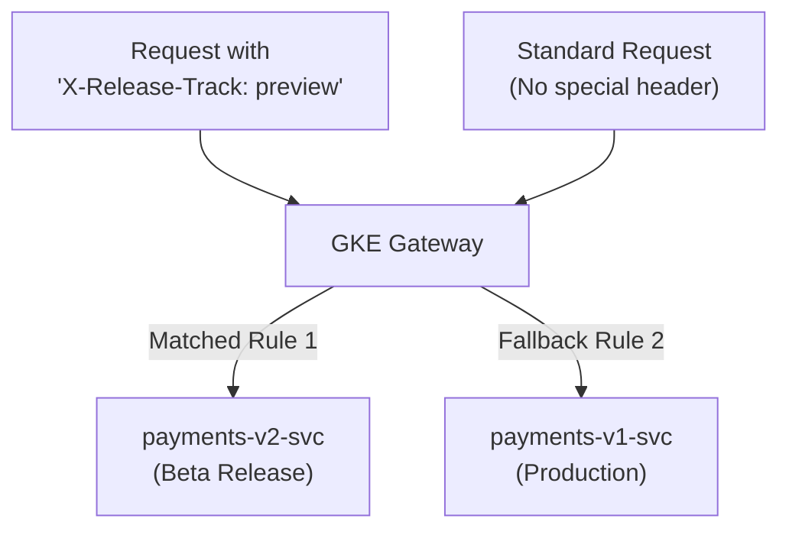

# Step 2: A/B Testing & Header Routing

**A/B Testing** (or conditional routing) allows teams to route requests to specific service variants based on request metadata—such as HTTP request headers, query string parameters, or authentication cookies.

This is ideal for:
- Internal employee testing ("dogfooding") in production before public launch.
- Beta customer opt-in programs.
- Microservice contract testing without affecting production consumers.

---

## 1. How Header Matching Works in Gateway API

In the Gateway API specification, rules are evaluated sequentially:
1. When a client sends a request matching specific `headers` or `queryParams`, it hits the prioritized rule pointing to `payments-v2-svc`.
2. When a normal request without the special header arrives, it falls through to the catch-all path prefix `/` pointing to `payments-v1-svc`.



---

## 2. Deploy the A/B Testing Route

Apply the A/B HTTPRoute:

```bash
kubectl apply -f manifests/05-deployment-strategies/ab-testing-route.yaml
```

Wait for route admission:
```bash
kubectl get httproute payments-ab-route -n traffic-lab
```

---

## 3. Hands-on Verification

Obtain the Gateway IP:
```bash
GATEWAY_IP=$(kubectl get gateway internal-gateway -n gateway-infra -o jsonpath='{.status.addresses[0].value}')
```

### 3.1 Scenario A: Regular User Request
Make a standard request without any special header:

```bash
kubectl exec -n fundamentals-lab -it dnsutils -- curl -s \
  -H "Host: ab.enterprise.internal" \
  http://${GATEWAY_IP}/
```

**Output:**
```
--- [PAYMENTS SERVICE v1.0.0] (Stable Production) ---
```
The request lands on the stable production version.

### 3.2 Scenario B: Request with Beta Header
Send a request containing the header `-H "X-Release-Track: preview"`:

```bash
kubectl exec -n fundamentals-lab -it dnsutils -- curl -s \
  -H "Host: ab.enterprise.internal" \
  -H "X-Release-Track: preview" \
  http://${GATEWAY_IP}/
```

**Output:**
```
*** [PAYMENTS SERVICE v2.0.0] (Canary / New Release) ***
```
The request is dynamically routed to the beta release!

### 3.3 Scenario C: Request with Query Parameter
Send a request containing the query parameter `?tier=beta`:

```bash
kubectl exec -n fundamentals-lab -it dnsutils -- curl -s \
  -H "Host: ab.enterprise.internal" \
  "http://${GATEWAY_IP}/?tier=beta"
```

**Output:**
```
*** [PAYMENTS SERVICE v2.0.0] (Canary / New Release) ***
```

---

## ⏭️ Next Step
Proceed to [**Step 3: Blue/Green Deployments**](03-blue-green.md) to implement atomic, zero-downtime cutover and instant rollback.

