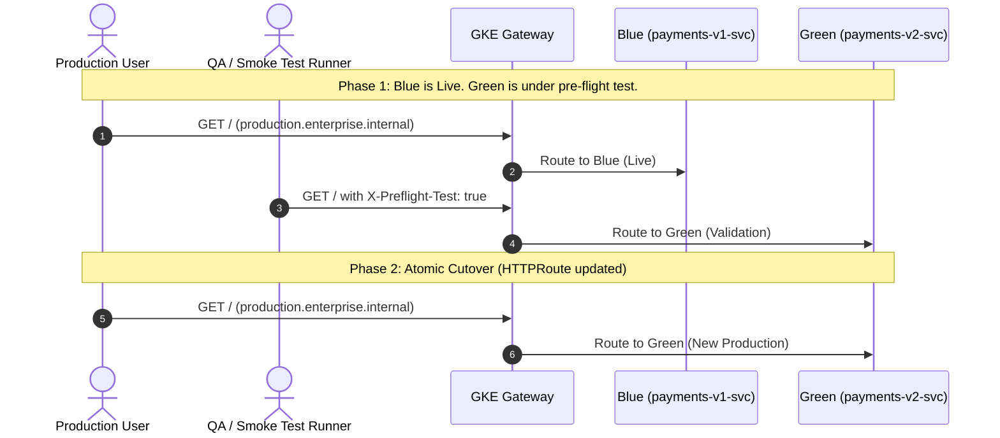

# Step 3: Blue/Green Deployments with Gateway API

In a **Blue/Green Deployment**, two separate and identical application environments run in parallel:
- **Blue**: The existing, active production environment (`payments-v1-svc`).
- **Green**: The newly deployed release candidate (`payments-v2-svc`).

Before routing production traffic to the Green environment, engineers perform automated end-to-end smoke testing directly through the load balancer. Once verified, traffic is switched **atomically** from Blue to Green.

---

## 1. Architecture Flow



---

## 2. Deploy the Blue/Green Route

Apply the manifest:

```bash
kubectl apply -f manifests/05-deployment-strategies/blue-green-route.yaml
```

Check the route status:
```bash
kubectl get httproute payments-production -n traffic-lab
```

---

## 3. Pre-Flight Smoke Testing (Validating Green)

Before initiating cutover, run integration tests against Green by passing the `X-Preflight-Test: true` header:

```bash
GATEWAY_IP=$(kubectl get gateway internal-gateway -n gateway-infra -o jsonpath='{.status.addresses[0].value}')

kubectl exec -n fundamentals-lab -it dnsutils -- curl -s \
  -H "Host: production.enterprise.internal" \
  -H "X-Preflight-Test: true" \
  http://${GATEWAY_IP}/
```

**Output:**
```
*** [PAYMENTS SERVICE v2.0.0] (Canary / New Release) ***
```

Confirm that regular traffic without the pre-flight header still hits Blue:

```bash
kubectl exec -n fundamentals-lab -it dnsutils -- curl -s \
  -H "Host: production.enterprise.internal" \
  http://${GATEWAY_IP}/
```

**Output:**
```
--- [PAYMENTS SERVICE v1.0.0] (Stable Production) ---
```

---

## 4. Performing the Atomic Cutover

To switch production traffic atomically from Blue to Green, update Rule 2's `backendRef` to `payments-v2-svc`:

```bash
kubectl patch httproute payments-production -n traffic-lab --type='json' \
  -p='[{"op": "replace", "path": "/spec/rules/1/backendRefs/0/name", "value": "payments-v2-svc"}]'
```

### Verify the Cutover:
Immediately test production traffic again:

```bash
kubectl exec -n fundamentals-lab -it dnsutils -- curl -s \
  -H "Host: production.enterprise.internal" \
  http://${GATEWAY_IP}/
```

**Output:**
```
*** [PAYMENTS SERVICE v2.0.0] (Canary / New Release) ***
```

The cutover occurred with zero dropped connections and zero downtime!

---

## 5. Instant Rollback

If a critical database bug or memory issue occurs post-cutover, execute an instantaneous rollback back to Blue:

```bash
kubectl patch httproute payments-production -n traffic-lab --type='json' \
  -p='[{"op": "replace", "path": "/spec/rules/1/backendRefs/0/name", "value": "payments-v1-svc"}]'
```

Verify that production traffic immediately routes back to `v1.0.0`:

```bash
kubectl exec -n fundamentals-lab -it dnsutils -- curl -s \
  -H "Host: production.enterprise.internal" \
  http://${GATEWAY_IP}/
```

---

## ⏭️ Next Step
Proceed to [**Step 4: Traffic Mirroring (Shadowing)**](04-traffic-mirroring.md) to test new versions under live traffic load without exposing users to risk.

