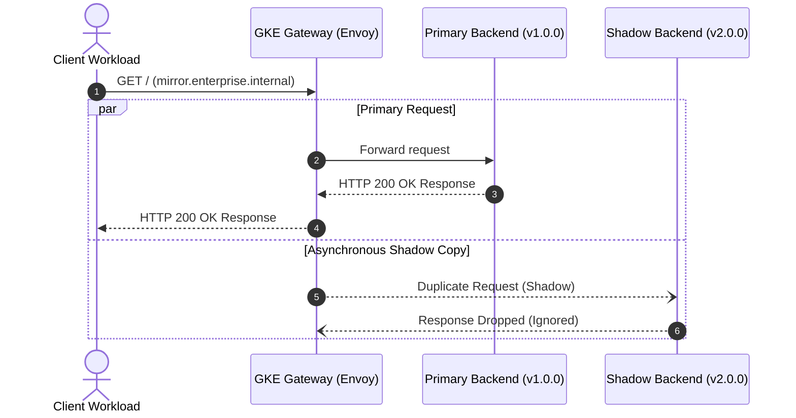

# Step 4: Traffic Mirroring (Shadowing)

**Traffic Mirroring** (also known as shadow traffic) is a deployment technique where production traffic is duplicated out-of-band and sent to an experimental version of a service without affecting the primary request/response cycle.

---

## 1. How Traffic Mirroring Works



### Key Properties:
- **Zero Risk**: The client *only* sees the response from the primary service (`payments-v1-svc`).
- **Asynchronous**: Responses from the shadowed service (`payments-v2-svc`) are discarded by the Gateway.
- **Fail-Safe**: If the mirrored service crashes, times out, or throws exceptions, it has **zero impact** on the end user.

---

## 2. Deploy Traffic Mirroring Route

Apply the mirroring HTTPRoute:

```bash
kubectl apply -f manifests/05-deployment-strategies/traffic-mirroring-route.yaml
```

Verify that the route is programmed:

```bash
kubectl get httproute payments-mirror-route -n traffic-lab
```

---

## 3. Hands-on Verification

Obtain the Gateway IP:
```bash
GATEWAY_IP=$(kubectl get gateway internal-gateway -n gateway-infra -o jsonpath='{.status.addresses[0].value}')
```

Send a request through the mirrored route:

```bash
kubectl exec -n fundamentals-lab -it dnsutils -- curl -s \
  -H "Host: mirror.enterprise.internal" \
  http://${GATEWAY_IP}/
```

**Client Output:**
```
--- [PAYMENTS SERVICE v1.0.0] (Stable Production) ---
```
The client receives the response exclusively from `payments-v1`.

### 3.1 Verify That Shadow Pods Received the Request
Check the logs of the `payments-v2` pods:

```bash
kubectl logs -n traffic-lab -l app=payments,version=v2 --tail=10
```

You will observe the mirrored HTTP request in the logs of `payments-v2`, confirming that the Envoy proxy duplicated the live request in real time!

---

## ⏭️ Next Step
Proceed to [**Module 6: Network Security & Policies**](../06-network-security/index.md) to apply Datapath v2 zero-trust microsegmentation.

