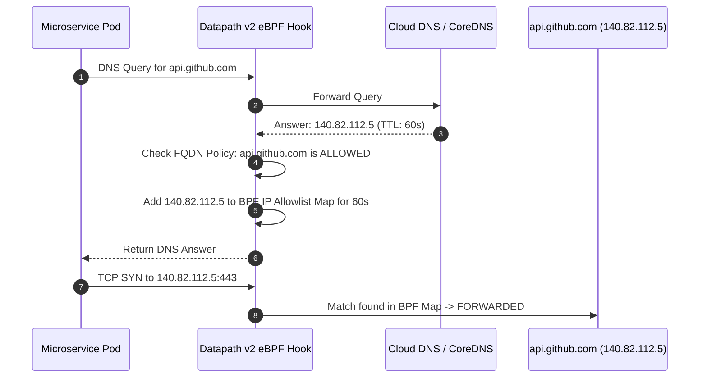

# Step 2: FQDN-Based Egress Policies

In enterprise security, controlling outbound internet egress is critical for preventing data exfiltration, ransomware command-and-control communication, and supply-chain attacks.

---

## 1. The Challenge with Standard IP-Based Egress Rules

Standard Kubernetes `NetworkPolicy` objects only support static IP CIDR blocks (`ipBlock.cidr`). However, modern SaaS APIs and third-party services (such as Stripe, GitHub, Salesforce, and Datadog) sit behind Anycast CDNs and multi-region cloud load balancers whose IP addresses change continuously.

Attempting to allow `0.0.0.0/0` on port 443 allows egress to the **entire internet**, violating the principle of least privilege.

---

## 2. GKE Datapath v2 FQDN Filtering

With GKE Datapath v2, the in-kernel eBPF agent intercepts DNS queries and responses generated by Pods. When a Pod resolves an approved domain name (e.g. `api.github.com`):
1. The Cilium/eBPF agent intercepts the DNS answer containing the newly resolved IP address.
2. The agent automatically inserts that IP address into a kernel-level BPF lookup map for the duration of the DNS record's TTL (Time to Live).
3. The pod's outbound TCP connection to that IP is dynamically permitted.
4. Connections to unapproved domain names or raw unapproved IP addresses remain strictly blocked.



---

## 3. Applying the FQDN Policy

Apply the FQDN Network Policy:

```bash
kubectl apply -f manifests/06-security/fqdn-egress-policy.yaml
```

Inspect the policy status:

```bash
kubectl get fqdnnetworkpolicies -n services-lab
```

---

## 4. Hands-on Verification

Execute a curl test to the allowed domain `api.github.com`:

```bash
API_POD=$(kubectl get pods -n services-lab -l app=web-api -o jsonpath='{.items[0].metadata.name}')

kubectl exec -n services-lab -it ${API_POD} -- curl -s -I --connect-timeout 5 https://api.github.com
```

**Expected Result:**
```http
HTTP/2 200 
server: GitHub.com
...
```

Now attempt to connect to an unauthorized domain (e.g. `example.com` or `google.com`):

```bash
kubectl exec -n services-lab -it ${API_POD} -- curl -s -I --connect-timeout 3 https://www.google.com
```

**Expected Result:**
```
curl: (28) Connection timed out
```
The packet is dropped by eBPF in kernel space because the domain is not in the authorized FQDN list!

---

## ⏭️ Next Step
Proceed to [**Step 3: Workload Identity & GKE Metadata Server**](03-workload-identity.md) to eliminate service account keys, authenticate pods to Google Cloud APIs, and handle metadata network policies.

