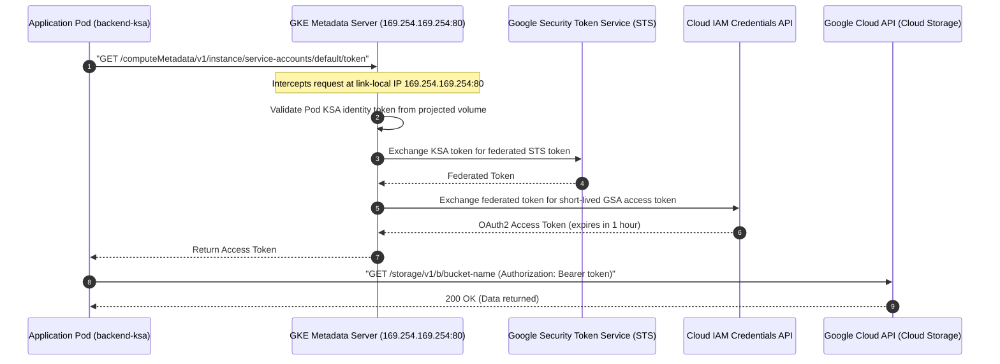

# Step 3: Workload Identity & GKE Metadata Server

**Workload Identity** is the recommended best practice for authenticating workloads running on Google Kubernetes Engine (GKE) to Google Cloud APIs (such as Cloud Storage, Secret Manager, Cloud SQL, and BigQuery).

It eliminates the severe security risks associated with exporting, distributing, and storing long-lived service account JSON keys inside Kubernetes Secrets.

---

## 1. Why Workload Identity?

| Dimension | Legacy Service Account Keys | GKE Workload Identity |
| :--- | :--- | :--- |
| **Credential Storage** | Static JSON keys stored in Kubernetes Secrets | Zero keys stored; short-lived tokens generated on-the-fly |
| **Leakage Risk** | High (keys can be copied, exported, or committed to git) | None (tokens cannot be exported or used outside the Pod) |
| **Credential Rotation** | Manual or scheduled rotation requiring pod restarts | Automatic rotation handled every hour by Google STS |
| **Privilege Scope** | Often cluster-wide or shared across multiple pods | Fine-grained: 1:1 binding between KSA and GSA |
| **Audit Logging** | Cloud Audit Logs only show the GSA, not the caller pod | Cloud Audit Logs record the cluster, namespace, and KSA name |

---

## 2. Architecture & The Metadata Server (Networking Deep Dive)

Workload Identity is implemented via a tight integration between Kubernetes Service Accounts and the **GKE Metadata Server**:



### How the Network Interception Works:
1. Every GKE node runs the `gke-metadata-server` DaemonSet.
2. In Datapath v2 (eBPF), requests from pods targeting the metadata IP address (`169.254.169.254:80`) are intercepted at the kernel level and redirected to the node's local `gke-metadata-server` process.
3. The metadata server queries the kubelet to verify which Pod originated the request, validates the Pod's projected ServiceAccount token, and communicates with Google STS to mint a short-lived token for the designated Google Service Account.

---

## 3. Step-by-Step Hands-on Setup

### Step 1: Define Environment Variables
Export the names for your Google Service Account (GSA), Kubernetes Service Account (KSA), and Namespace:

```bash
export PROJECT_ID=$(gcloud config get-value project)
export GSA_NAME="gke-storage-reader"
export GSA_EMAIL="${GSA_NAME}@${PROJECT_ID}.iam.gserviceaccount.com"
export K8S_NAMESPACE="backend-app"
export K8S_SA_NAME="backend-ksa"
```

### Step 2: Create the Google Service Account (GSA)
Create the IAM service account in Google Cloud:

```bash
gcloud iam service-accounts create ${GSA_NAME} \
    --project=${PROJECT_ID} \
    --description="GSA for GKE Workload Identity lab" \
    --display-name="GKE Storage Reader"
```

### Step 3: Grant Least-Privilege IAM Roles to the GSA
Grant the GSA read-only permissions to Cloud Storage:

```bash
gcloud projects add-iam-policy-binding ${PROJECT_ID} \
    --member="serviceAccount:${GSA_EMAIL}" \
    --role="roles/storage.objectViewer"
```

### Step 4: Create the Kubernetes Namespace and Service Account (KSA)
Create the Kubernetes namespace and service account:

```bash
kubectl create namespace ${K8S_NAMESPACE} --dry-run=client -o yaml | kubectl apply -f -

kubectl create serviceaccount ${K8S_SA_NAME} \
    --namespace=${K8S_NAMESPACE} \
    --dry-run=client -o yaml | kubectl apply -f -
```

### Step 5: Bind KSA to GSA via Workload Identity User
Allow the Kubernetes Service Account to impersonate the Google Service Account by granting the `roles/iam.workloadIdentityUser` role.

The member string follows this exact format:
`serviceAccount:${PROJECT_ID}.svc.id.goog[${K8S_NAMESPACE}/${K8S_SA_NAME}]`

```bash
gcloud iam service-accounts add-iam-policy-binding ${GSA_EMAIL} \
    --project=${PROJECT_ID} \
    --role="roles/iam.workloadIdentityUser" \
    --member="serviceAccount:${PROJECT_ID}.svc.id.goog[${K8S_NAMESPACE}/${K8S_SA_NAME}]"
```

### Step 6: Annotate the Kubernetes Service Account
Annotate the Kubernetes Service Account with the email address of the Google Service Account:

```bash
kubectl annotate serviceaccount ${K8S_SA_NAME} \
    --namespace=${K8S_NAMESPACE} \
    iam.gke.io/gcp-service-account=${GSA_EMAIL} \
    --overwrite
```

---

## 4. Deploying Workloads & Network Policy Integration

When implementing **Zero-Trust Network Policies** (as configured in [Step 1](01-network-policies.md)), all outbound egress from Pods is blocked by default. 

> [!WARNING]
> If a Default-Deny egress NetworkPolicy is in place, Pods will **fail to authenticate** because outbound traffic to the metadata IP `169.254.169.254:80` is blocked by eBPF!

To resolve this, your NetworkPolicy must explicitly whitelist egress to `169.254.169.254/32` on port 80.

Inspect the complete manifest in `manifests/06-security/workload-identity.yaml`:

```yaml
apiVersion: v1
kind: Namespace
metadata:
  name: backend-app
---
apiVersion: v1
kind: ServiceAccount
metadata:
  name: backend-ksa
  namespace: backend-app
  annotations:
    iam.gke.io/gcp-service-account: gke-storage-reader@${PROJECT_ID}.iam.gserviceaccount.com
---
apiVersion: apps/v1
kind: Deployment
metadata:
  name: workload-identity-test
  namespace: backend-app
spec:
  replicas: 1
  selector:
    matchLabels:
      app: workload-identity-test
  template:
    metadata:
      labels:
        app: workload-identity-test
    spec:
      serviceAccountName: backend-ksa
      nodeSelector:
        iam.gke.io/gke-metadata-server-enabled: "true"
      containers:
        - name: cloud-sdk
          image: google/cloud-sdk:slim
          command: ["sleep", "36000"]
---
apiVersion: networking.k8s.io/v1
kind: NetworkPolicy
metadata:
  name: allow-metadata-and-dns
  namespace: backend-app
spec:
  podSelector:
    matchLabels:
      app: workload-identity-test
  policyTypes:
    - Egress
  egress:
    # 1. Allow internal cluster DNS resolution
    - to: []
      ports:
        - protocol: UDP
          port: 53
        - protocol: TCP
          port: 53
    # 2. Allow GKE Metadata Server (Workload Identity)
    - to:
        - ipBlock:
            cidr: 169.254.169.254/32
      ports:
        - protocol: TCP
          port: 80
    # 3. Allow outbound HTTPS to Google Cloud APIs
    - to:
        - ipBlock:
            cidr: 0.0.0.0/0
      ports:
        - protocol: TCP
          port: 443
```

Deploy the workload and network policy:

```bash
kubectl apply -f manifests/06-security/workload-identity.yaml
```

Wait for the test pod to reach `Running` state:

```bash
kubectl wait --namespace=${K8S_NAMESPACE} \
    --for=condition=ready pod \
    --selector=app=workload-identity-test \
    --timeout=90s
```

---

## 5. Hands-on Verification

### 5.1 Verify Service Account Identity Inside the Pod
Query the GKE Metadata Server from inside the pod to verify that it resolves to your custom Google Service Account:

```bash
WI_POD=$(kubectl get pods -n ${K8S_NAMESPACE} -l app=workload-identity-test -o jsonpath='{.items[0].metadata.name}')

kubectl exec -n ${K8S_NAMESPACE} -it ${WI_POD} -- curl -s -H "Metadata-Flavor: Google" \
    http://metadata.google.internal/computeMetadata/v1/instance/service-accounts/default/email
```

**Expected Output:**
```
gke-storage-reader@my-gke-enterprise-project.iam.gserviceaccount.com
```

> [!IMPORTANT]
> If the output shows `<PROJECT_NUMBER>-compute@developer.gserviceaccount.com` (the Compute Engine default service account), Workload Identity is **not** properly bound. See the troubleshooting section below.

### 5.2 Inspect the OAuth2 Token
Inspect the short-lived access token generated by the metadata server:

```bash
kubectl exec -n ${K8S_NAMESPACE} -it ${WI_POD} -- curl -s -H "Metadata-Flavor: Google" \
    http://metadata.google.internal/computeMetadata/v1/instance/service-accounts/default/token
```

**Expected Output:**
```json
{
  "access_token": "ya29.c.b0...",
  "expires_in": 3599,
  "token_type": "Bearer"
}
```

Notice that the token has an `expires_in` of ~3600 seconds (1 hour). The Google Cloud client libraries (`google-cloud-storage`, `google-cloud-secret-manager`, etc.) automatically refresh this token transparently before expiration.

### 5.3 Test Google Cloud API Access
Run a `gcloud storage` or `gsutil` command directly inside the container without providing any credentials or environment flags:

```bash
kubectl exec -n ${K8S_NAMESPACE} -it ${WI_POD} -- gcloud storage buckets list
```

**Expected Output:**
```
[
  gs://your-bucket-1/,
  gs://your-bucket-2/
]
```

The command succeeds seamlessly without any `GOOGLE_APPLICATION_CREDENTIALS` file mounted into the Pod.

---

## 6. Common DevOps Troubleshooting Pitfalls

### Pitfall 1: Pod receives Compute Engine Default Service Account
* **Symptom**: `curl .../service-accounts/default/email` returns `<project-number>-compute@developer.gserviceaccount.com`.
* **Root Causes**:
  1. The KSA was annotated *after* the Pod started. GKE does not retroactively inject the projected token into running pods.
  2. Typo in the annotation key: must be exactly `iam.gke.io/gcp-service-account`.
  3. Workload Identity was not enabled on the node pool (`--workload-metadata=GKE_METADATA`).
* **Fix**:
  ```bash
  # Check annotation
  kubectl get sa ${K8S_SA_NAME} -n ${K8S_NAMESPACE} -o yaml
  # Restart the deployment to inject fresh metadata credentials
  kubectl rollout restart deployment/workload-identity-test -n ${K8S_NAMESPACE}
  ```

### Pitfall 2: `403 Forbidden` / `Caller does not have required permission to use workload identity`
* **Symptom**: Google Cloud API calls fail with `403 AccessDenied` or permission errors.
* **Root Cause**: The IAM policy binding between the GSA and KSA is missing or has a malformed member string.
* **Fix**: Ensure the member syntax is exact:
  ```bash
  gcloud iam service-accounts get-iam-policy ${GSA_EMAIL}
  ```
  Look for:
  ```yaml
  bindings:
  - members:
    - serviceAccount:PROJECT_ID.svc.id.goog[backend-app/backend-ksa]
    role: roles/iam.workloadIdentityUser
  ```

### Pitfall 3: `curl: (28) Failed to connect to metadata.google.internal port 80: Connection timed out`
* **Symptom**: The pod cannot connect to the metadata server and times out after 30+ seconds.
* **Root Cause**: A Kubernetes `NetworkPolicy` with `policyTypes: [Egress]` is blocking outbound traffic to `169.254.169.254:80`.
* **Fix**: Add an explicit egress rule for `169.254.169.254/32` on port `80` to your NetworkPolicy as shown in Section 4.

---

## ⏭️ Next Step
Proceed to [**Module 7: Troubleshooting & Diagnostics**](../07-troubleshooting/index.md) to practice incident response, packet tracing, and network debugging in production GKE clusters.
