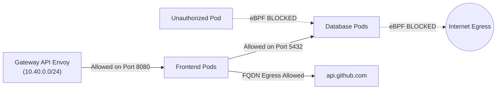

# Module 6: Enterprise Network Security & Policies

In a multi-tenant enterprise Kubernetes cluster, standard flat networking (where any pod can talk to any other pod and any IP on the internet) represents a significant security liability.

With **GKE Datapath v2**, NetworkPolicies are enforced natively by **eBPF** in the Linux kernel, without the packet processing latency or rule-ordering bugs common in legacy `iptables` implementations.

---

## 🎯 Objectives

1. **Default-Deny Zero-Trust**: Apply a baseline policy that denies all unauthorized ingress and egress traffic across a namespace.
2. **Selective Ingress for Gateways & DNS**: Selectively re-open port 53 UDP/TCP for internal cluster DNS and allow ingress strictly from the Gateway API Envoy proxies.
3. **Pod-to-Pod Microsegmentation**: Restrict database and backend pods to only accept connections from authorized frontend microservices.
4. **FQDN-Based Egress Filtering**: Enforce egress policies that restrict external outbound internet calls to specific approved Fully Qualified Domain Names (e.g. `api.github.com`), blocking all other outbound destinations.
5. **Workload Identity & Metadata Security**: Eliminate exported service account keys, authenticate pods via GKE Metadata Server (`169.254.169.254`), and configure egress NetworkPolicies for metadata access.

---

## 🧭 Zero-Trust Microsegmentation Flow

---

## 📂 Module Steps

1. [**Step 1: Datapath v2 Network Policies**](01-network-policies.md) - Default-deny, namespace isolation, and microsegmentation.
2. [**Step 2: FQDN Egress Policies**](02-fqdn-egress.md) - Enforcing domain-based egress security rules.
3. [**Step 3: Workload Identity & Metadata Server**](03-workload-identity.md) - Keyless Google Cloud authentication, STS token exchange, and metadata egress policies.

