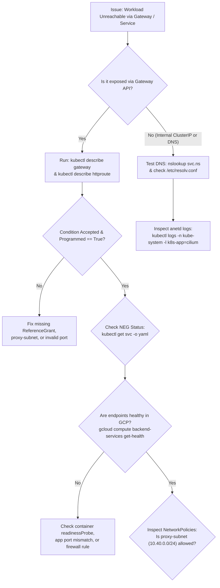

# Module 7: Troubleshooting & Observability

Even well-architected Kubernetes platforms encounter network anomalies: misconfigured Gateway routes, unsynchronized NEGs, DNS lookup delays, or restrictive network policies dropping valid packets.

This module provides a diagnostic runbook for GKE networking.

---

## 🎯 Objectives

1. **Gateway API Diagnostics**: Interpret Gateway and HTTPRoute condition statuses (`Programmed`, `Accepted`, `ResolvedRefs`).
2. **NEG & Load Balancer Debugging**: Diagnose why an endpoint is marked unhealthy by Google Cloud load balancer health checks.
3. **Datapath v2 Flow Logs**: Inspect Cilium eBPF packet drop counters and flow logs.
4. **Interactive Network Diagnostic Pod**: Deploy a network toolbox pod equipped with `tcpdump`, `mtr`, `iperf3`, `curl`, and `dig`.

---

## 🛠️ The GKE Network Troubleshooting Flowchart

---

## 📂 Module Steps

1. [**Diagnostic Guide & Production Runbook**](01-diagnostics-guide.md)

