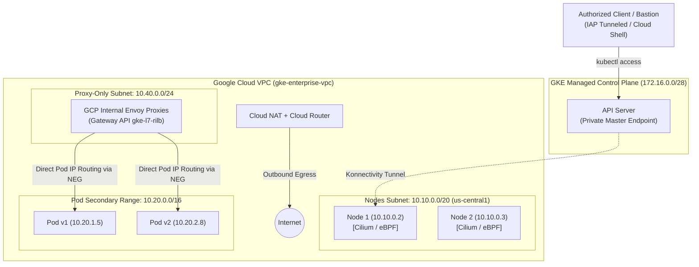

# GKE Enterprise Networking Hands-On Lab

Welcome to the **Google Kubernetes Engine (GKE) Enterprise Networking Hands-On Lab**!

This self-paced, interactive laboratory guide is designed for Platform Engineers, Network Architects, and SREs who want to master real-world networking topologies in Google Cloud and GKE.

---

## 🎯 Lab Objectives

By completing this hands-on lab, you will:

1. **Architect Enterprise VPC Infrastructure**: Build a custom Google Cloud VPC with primary subnets, secondary IP alias ranges for Pods and Services, proxy-only subnets for Envoy, and Cloud NAT for secure egress.
2. **Deploy Production-Ready Private GKE**: Spin up a fully private GKE cluster using `gcloud` with Datapath v2 (eBPF/Cilium), Gateway API, Workload Identity, Shielded Nodes, and Master Authorized Networks.
3. **Master GKE Networking Fundamentals**: Deep-dive into VPC-native alias IPs, eBPF packet routing (eliminating iptables / kube-proxy), and Cloud DNS for GKE.
4. **Understand Kubernetes Services & NEGs**: Explore ClusterIP, Headless Services, Internal TCP/UDP Load Balancers, and direct pod-level Container-Native Load Balancing via Network Endpoint Groups (NEGs).
5. **Implement the Modern Gateway API**: Configure the GKE Gateway Controller with Internal Application Load Balancers (`gke-l7-rilb`), multi-path routing, header rewrites, and TLS.
6. **Execute Advanced Traffic Strategies**: Implement production deployment patterns using Gateway API:
    - **Canary Releases** (fine-grained traffic weighting e.g. 90/10)
    - **A/B Testing** (HTTP header, cookie, and query-string routing)
    - **Blue/Green Deployments** (atomic zero-downtime cutover & instant rollback)
    - **Traffic Mirroring / Shadowing** (dark traffic testing)
7. **Enforce Enterprise Security**: Apply Datapath v2 Network Policies for microsegmentation and FQDN egress domain filtering.
8. **Diagnose & Troubleshoot**: Learn enterprise debugging techniques for Gateways, NEGs, DNS lookup failures, and packet drops.

---

## 🏛️ Lab Architecture



---

## 📋 Prerequisites & Tools

Before starting the lab, ensure you have:

- A **Google Cloud Platform (GCP) Project** with owner or editor permissions and billing enabled.
- The **Google Cloud SDK (`gcloud`)** installed and authenticated:
  ```bash
  gcloud auth login
  gcloud auth application-default login

  # Ensure horizontal tables render properly in your terminal
  gcloud config set accessibility/screen_reader false
  ```
- **`kubectl`** CLI:
  ```bash
  gcloud components install kubectl
  ```
- **`jq`** and **`curl`** installed on your workstation.
- Familiarity with core Kubernetes concepts (Pods, Deployments, Services, Namespaces).

---

## 📥 Clone the Lab Repository

All Kubernetes YAML manifests, configurations, and helper scripts used throughout this lab are hosted in the repository. Clone the repo to your workstation (or Cloud Shell / Bastion host) and navigate into the directory so the manifests are ready to apply:

```bash
git clone https://github.com/amr1k/gke-fundamentals-lab.git
cd gke-fundamentals-lab
```

> [!TIP]
> Keep your terminal session inside the `gke-fundamentals-lab` directory. All subsequent `kubectl apply -f manifests/...` commands in the modules assume you are in the repository root.

---

## 🚀 Lab Modules

Navigate through the sections using the left sidebar or the direct links below:

<div class="grid cards" markdown>

-   :material-server-network:{ .lg .middle } __Module 1: Enterprise Cluster Setup__

    ---

    Provision VPC, subnets, secondary ranges, Cloud NAT, and a private GKE cluster with Datapath v2 and Gateway API enabled.

    [:octicons-arrow-right-24: Start Module 1](01-cluster-setup/index.md)

-   :material-lan:{ .lg .middle } __Module 2: Networking Fundamentals__

    ---

    Understand VPC-native alias IPs, Datapath v2 eBPF routing, Cloud DNS for GKE, and inspect packet walks.

    [:octicons-arrow-right-24: Start Module 2](02-networking-fundamentals/index.md)

-   :material-swap-horizontal:{ .lg .middle } __Module 3: Services & Load Balancing__

    ---

    Compare ClusterIP, Headless services, Internal TCP/UDP L4 load balancers, and container-native NEGs.

    [:octicons-arrow-right-24: Start Module 3](03-services-and-load-balancing/index.md)

-   :material-gate:{ .lg .middle } __Module 4: Gateway API__

    ---

    Configure the GKE Gateway Controller, internal application load balancer gateways (`gke-l7-rilb`), HTTPRoute, and TLS.

    [:octicons-arrow-right-24: Start Module 4](04-gateway-api/index.md)

-   :material-call-split:{ .lg .middle } __Module 5: Deployment Strategies__

    ---

    Implement real-world deployment strategies with Gateway API: Canary (weighted splits), A/B testing, and Blue/Green cutover.

    [:octicons-arrow-right-24: Start Module 5](05-deployment-strategies/index.md)

-   :material-shield-lock:{ .lg .middle } __Module 6: Network Security__

    ---

    Enforce zero-trust pod microsegmentation with Datapath v2 Network Policies and external FQDN domain egress filtering.

    [:octicons-arrow-right-24: Start Module 6](06-network-security/index.md)

-   :material-stethoscope:{ .lg .middle } __Module 7: Troubleshooting__

    ---

    Hands-on runbook to diagnose Gateway API status conditions, NEG sync issues, DNS latency, and packet drops.

    [:octicons-arrow-right-24: Start Module 7](07-troubleshooting/index.md)

-   :material-delete-sweep:{ .lg .middle } __Teardown & Cleanup__

    ---

    Safely decommission all cluster and VPC resources to prevent continuing GCP infrastructure charges.

    [:octicons-arrow-right-24: Clean up resources](cleanup.md)

</div>

